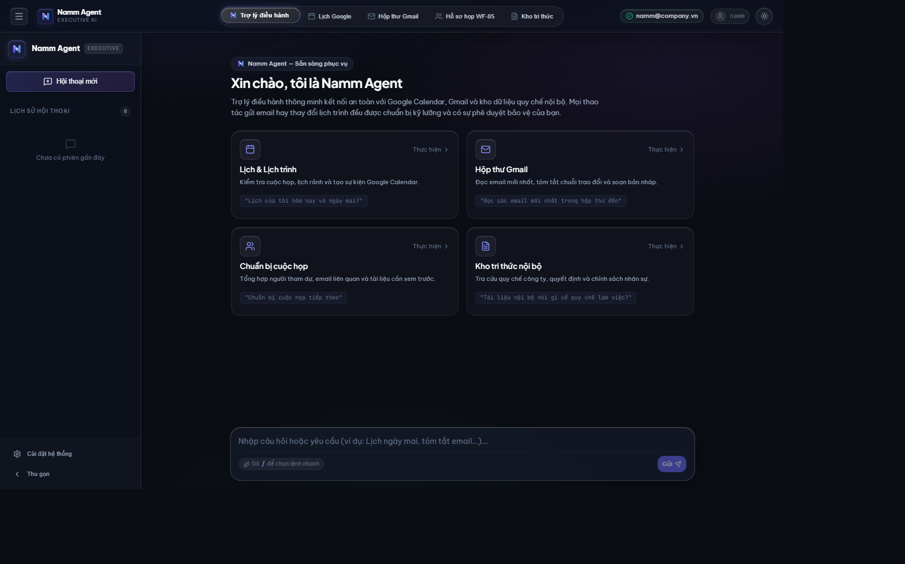
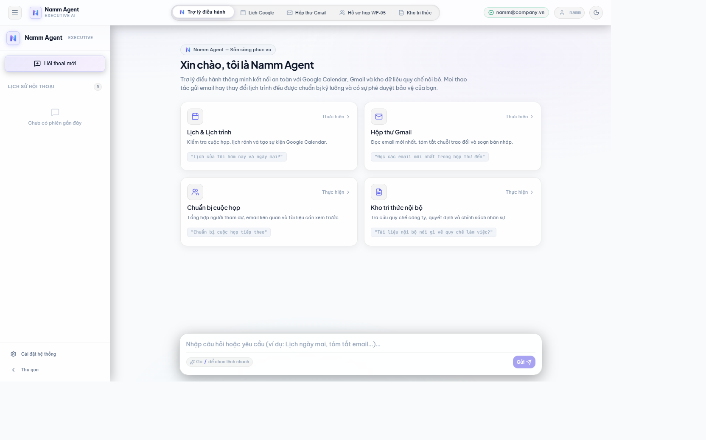
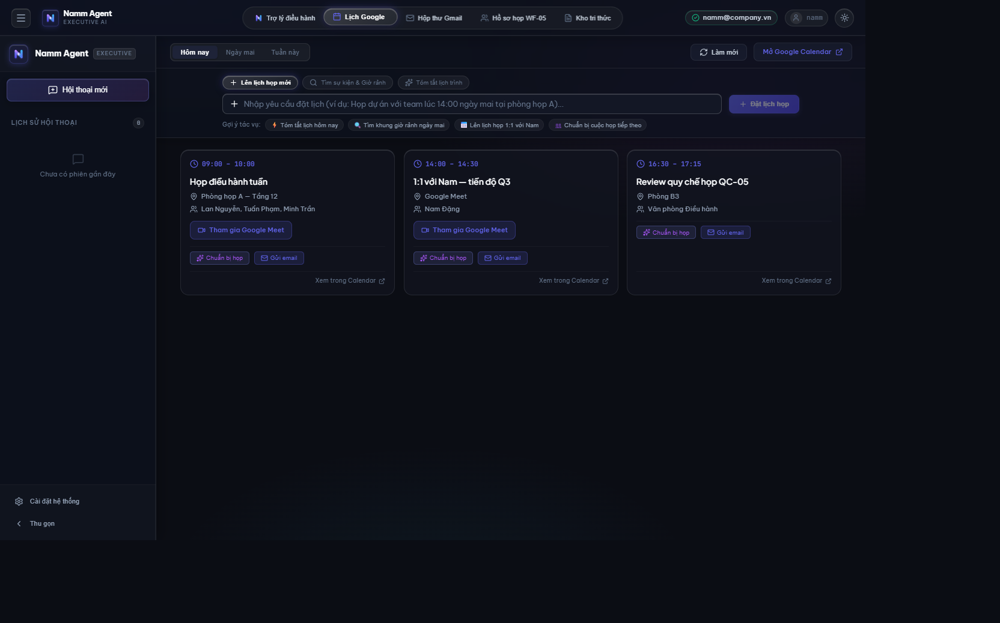
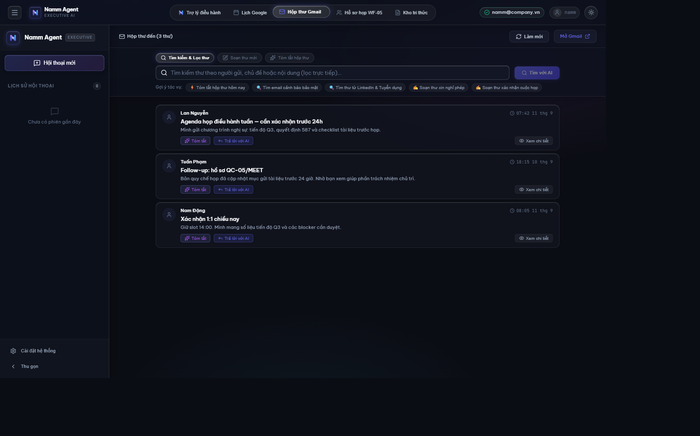
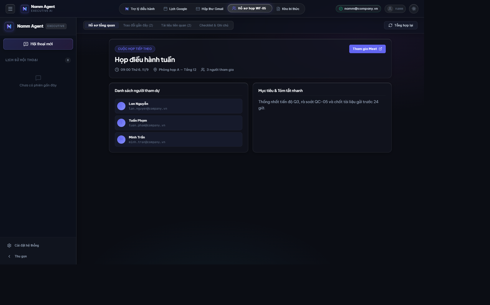
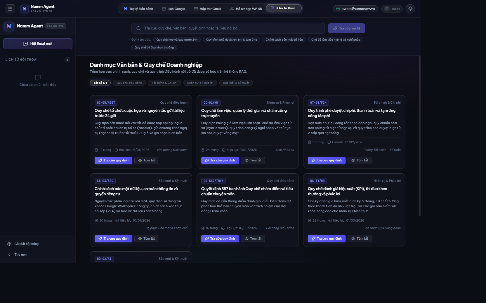
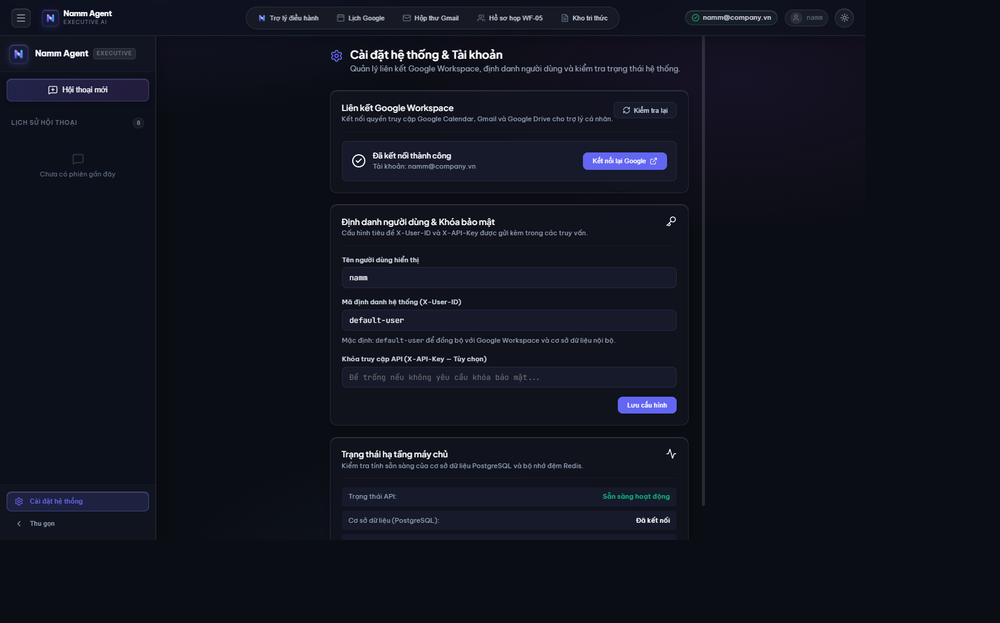

# Personal AI Assistant

Trợ lý cá nhân nói tiếng Việt, làm việc trên Google Workspace và kho tài liệu nội bộ của bạn.

Hỏi lịch, đọc mail, tìm quyết định, chuẩn bị họp, soạn follow-up — bằng câu thường, không cần nhớ lệnh. Việc chỉ đọc thì trợ lý làm luôn. Việc gửi đi, đặt lịch hay xóa thì dừng lại để bạn duyệt một lần.

## Làm được gì

- **Lịch** — xem hôm nay, ngày mai, tuần này; đặt cuộc họp khi bạn nói rõ giờ.
- **Email** — đọc hộp thư, lọc theo người gửi; soạn nháp follow-up sau cuộc họp.
- **Tài liệu nội bộ** — trả lời từ kho văn bản đã nạp, kèm dẫn chứng thay vì đoán.
- **Chuẩn bị họp** — gom lịch, mail khách mời và tài liệu liên quan thành một hồ sơ ngắn.
- **Google Drive** — tìm và đọc file; thao tác ghi (chuyển, xóa) chỉ sau khi bạn đồng ý.

Ví dụ bạn có thể nói:

- «Lịch ngày mai?»
- «Đọc email mới nhất từ anh Nam»
- «Tài liệu nội bộ nói gì về quy chế họp?»
- «Chuẩn bị họp ngày mai với Nam»
- «Tạo lịch họp lúc 10h sáng mai»
- «Soạn thư cuộc họp»

## Giao diện

Ứng dụng web **Naot** (React) — hỏi bằng câu thường, xem lịch và Gmail, chuẩn bị họp, tra cứu quy chế, duyệt hành động ghi. Có chế độ tối và sáng.

**Trợ lý điều hành**





**Lịch Google**



**Hộp thư Gmail**



**Hồ sơ họp**



**Kho tri thức**



**Cài đặt**



## Cách trợ lý làm việc

Câu hỏi đơn giản (một việc, một nguồn) được xử lý thẳng. Việc lặp lại như chuẩn bị họp chạy theo kịch bản cố định. Việc lan sang nhiều nguồn được lập kế hoạch rồi mới làm.

Mọi hành động ghi — tạo/sửa/xóa lịch, gửi hay xóa mail, đổi file trên Drive — đều cần bạn xác nhận. Token duyệt dùng một lần, không gửi lại được.

Dữ liệu được tách theo người dùng. Log không giữ nguyên email hay khóa API.

## Chạy trên máy bạn

Cần **Python 3.11–3.14**, **Docker** (Postgres + Redis), và tài khoản Google OAuth nếu muốn lịch/mail/Drive thật.

```bash
uv venv
uv sync --extra dev
cp .env.example .env
```

Điền `.env`: khóa API (`SECURITY__API_KEY`), khóa ký duyệt (`SECURITY__APPROVAL_SIGNING_KEY`, tối thiểu 32 ký tự), mật khẩu Postgres/Redis, và nếu dùng Google thì `GOOGLE_CLIENT_ID` / `GOOGLE_CLIENT_SECRET`. Không commit file `.env`.

```bash
docker compose up -d
uv run alembic upgrade head
uv run uvicorn app.main:app --host 127.0.0.1 --port 8000
```

Kiểm tra sống: `GET http://127.0.0.1:8000/health`  
Tài liệu API: `http://127.0.0.1:8000/api/v1/docs`

Giao diện web (Vite, cổng 5173; proxy API về backend):

```bash
cd frontend
npm install
npm run dev
```

Mở `http://localhost:5173`. `docker compose up -d` cũng dựng frontend tại cổng đó.

## Kết nối Google

Mở trình duyệt:

```
http://127.0.0.1:8000/auth/google/start
```

Đăng nhập Google, cấp quyền lịch / Gmail / Drive tùy việc bạn dùng. Redirect mặc định: `http://localhost:8000/auth/google/callback`.

## Nói chuyện với trợ lý

Mọi câu hỏi đi qua `POST /query`. Trong môi trường local, gửi kèm `X-API-Key` (nếu đã cấu hình) và `X-User-ID`.

```bash
curl -s http://127.0.0.1:8000/query \
  -H "Content-Type: application/json" \
  -H "X-User-ID: default-user" \
  -H "X-API-Key: $SECURITY__API_KEY" \
  -d '{"query": "Lịch ngày mai?"}'
```

Khi cần duyệt, phản hồi có `approval_id`. Tạo sự kiện hoặc nháp trên Google:

```bash
curl -s -X POST "http://127.0.0.1:8000/approvals/<approval_id>/approve" \
  -H "Content-Type: application/json" \
  -H "X-User-ID: default-user" \
  -H "X-API-Key: $SECURITY__API_KEY" \
  -d '{"execute": true}'
```

Không gửi `execute` thì bạn chỉ nhận token một lần; lần sau dùng `POST /approvals/<id>/execute` với token đó.

## Kho tài liệu

Nạp PDF/DOCX vào Postgres (pgvector + tìm kiếm đầy đủ). Trợ lý trả lời từ kho này, không bịa nguồn. Embedding tiếng Việt chạy local nếu bạn cài extra `ml` và trỏ đường dẫn model trong `.env`.

File scan (PDF ảnh) xử lý **ngoài** runtime, trên máy có GPU, rồi mới nạp markdown:

```bash
uv pip install -e ".[ocr-paddle]"   # hoặc ".[ocr-surya]"
python scripts/ocr_batch.py --input-dir ./scanned_pdfs --output-dir ./parsed_md \
  --engine paddleocr_vl_1_6 --device cuda:0
```

Mỗi file ra `.md` và sidecar `.ocr.json`. Nạp thư mục output với `source_type="preparsed_markdown"`.

## Phát triển

```bash
uv run pytest
uv run ruff check .
```

## Stack

FastAPI · PostgreSQL 16 + pgvector · Redis 7 · Google Calendar / Gmail / Drive · mô hình embedding/rerank tiếng Việt.
