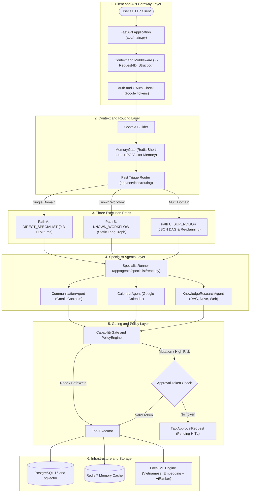
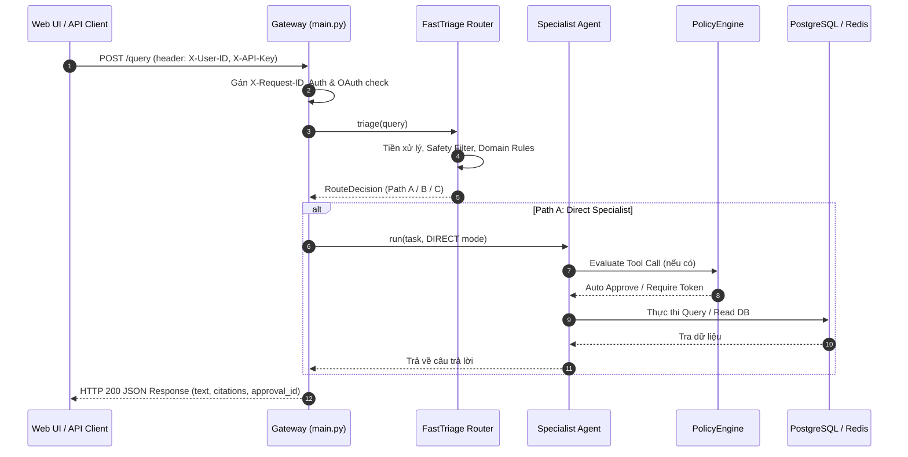

# TẬP 1: TỔNG QUAN KIẾN TRÚC HỆ THỐNG & HẠ TẦNG (SYSTEM OVERVIEW & INFRASTRUCTURE)

> **Cấp độ tài liệu**: Sách tham khảo kỹ thuật chuyên sâu - Tập 1/6 (Technical Architecture Manual - Volume 1).
> **Trạng thái hệ thống**: P0–P14 đã nghiệm thu & đóng (`CLOSED`), Phase 15 (`FastTriage & Static Workflows`) hoàn thiện.

---

## 1. TRIẾT LÝ THIẾT KẾ CỐT LÕI (CORE DESIGN PHILOSOPHY)

Hệ thống Trợ lý AI Cá nhân (Personal AI Assistant) được thiết kế để giải quyết 3 thách thức lớn nhất trong ứng dụng AI doanh nghiệp:
1. **Bùng nổ Latency & Chi phí Token**: Khi môt câu hỏi đơn giản cũng phải đi qua Supervisor LLM để phân tích, dẫn đến thời gian phản hồi kéo dài (5–10s) và tiêu tốn quá nhiều LLM Tokens.
2. **Ảo giác tri thức (Hallucination)**: Khi LLM đoán mò câu trả lời do không có thông tin nội bộ hoặc do tìm kiếm RAG bị nhiễu.
3. **Nguy cơ rủi ro an toàn dữ liệu**: Khi AI được cấp quyền tự động gửi email, sửa lịch hoặc xóa file trên Google Drive mà không có kiểm soát.

👉 **Tuyên ngôn kiến trúc cốt lõi**:
> *"Multi-Agent is a capability boundary, not an execution requirement"*
> (Đa tác tử là ranh giới phân định năng lực và bảo mật, không phải là yêu cầu bắt buộc cho mọi luồng thực thi).

---

## 2. SƠ ĐỒ KIẾN TRÚC TỔNG THỂ 6 TẦNG (END-TO-END SYSTEM ARCHITECTURE)



---

## 3. PHÂN TÍCH CHI TIẾT CÁC TẦNG HẠ TẦNG (INFRASTRUCTURE & CORE SERVICES)

### 3.1. Tầng 1: API Gateway & Middleware Framework (`app/main.py`)

* **Nhiệm vụ**: Quản lý điểm tiếp nhận HTTP Request, khởi tạo Context tracking và xác thực OAuth.
* **Cơ chế hoạt động**:
  1. **Correlation Tracing**: Mỗi request đi qua FastAPI Middleware sẽ được tiêm một chuỗi định danh duy nhất `X-Request-ID` (UUIDv4). Mã này được bind vào đối tượng `Structlog` context. Tất cả các thành phần downstream (Router, Agents, Tool Executors, DB Queries) đều mang vết `request_id` này trong log.
  2. **FastAPI Exception Handlers**: Bắt các ngoại lệ chuẩn hóa (`DomainError`, `ValidationError`, `PermissionDeniedError`) và chuyển đổi thành HTTP JSON response có cấu trúc nhất quán.
  3. **Google OAuth Token Manager**: Tra cứu bảng `google_integrations`. Nếu mã OAuth Access Token hết hạn, tự động dùng `refresh_token` để xin token mới từ Google OAuth2 endpoints trước khi chuyển tiếp lệnh tới Google APIs.

### 3.2. Tầng 2: MemoryGate & Context Preparation (`app/services/context/`)

* **Nhiệm vụ**: Tổng hợp ký ức ngắn hạn (Short-term buffer) và ký ức dài hạn (Long-term memories) để xây dựng Prompt Context cho các Agent.
* **Cơ chế hoạt động**:
  1. **Short-term Memory (Redis 7)**:
     * Lưu trữ dưới dạng danh sách tin nhắn gần nhất (`List[Message]`) theo `session_id`.
     * TTL mặc định: 24 giờ (`86400s`).
  2. **Long-term Memory (PostgreSQL pgvector)**:
     * Ký ức về thói quen, sở thích, người liên hệ quan trọng được lưu trong bảng `memories`.
     * Khi có câu hỏi mới, `MemoryGate` tính vector câu hỏi và thực hiện truy vấn pgvector Cosine Distance:
       ```sql
       SELECT id, content, (embedding <=> :query_vector) AS distance
       FROM memories
       WHERE user_id = :user_id AND (embedding <=> :query_vector) < 0.35
       ORDER BY distance ASC LIMIT 5;
       ```
     * Các ký ức phù hợp được tiêm trực tiếp vào System Preamble của Agent.

### 3.3. Tầng 6: Infrastructure & Storage Engine

* **PostgreSQL 16 (với pgvector extension)**:
  * Đóng vai trò vừa là CSDL Quan hệ (ACID) vừa là CSDL Vector.
  * Hỗ trợ chỉ mục **HNSW** (`vector_cosine_ops`) cho tìm kiếm ngữ nghĩa siêu tốc.
  * Hỗ trợ chỉ mục **GIN** trên cột `tsvector` cho tìm kiếm từ khóa Full-Text Search với từ điển tiếng Việt `vietnamese_simple`.
* **Redis 7 (Alpine)**:
  * Đóng vai trò Cache tầng thấp, Session Store và Distributed Lock (`Redlock`) để tránh tranh chấp khi ghi dữ liệu song song.
* **Local ML Engine**:
  * Chạy trực tiếp trên môi trường Server mà không gọi API ngoài:
    * Embedding Model: `AITeamVN/Vietnamese_Embedding` (1024 dimensions, L2-normalized).
    * Reranker Model: `namdp-ptit/ViRanker` (Cross-Encoder đánh giá điểm tương quan query-chunk).

---

## 4. QUY TRÌNH XỬ LÝ MỘT REQUEST THỰC TẾ (END-TO-END REQUEST LIFECYCLE)



---

*Xem tiếp chi tiết 3 Tuyến thực thi tại Tập 2: [`02-execution-paths-and-routing.md`](file:///d:/Code/personal_ai_assistant/docs/architecture/02-execution-paths-and-routing.md)*
