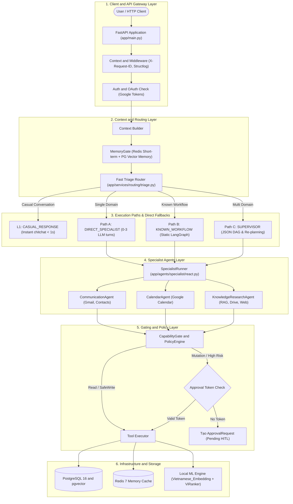
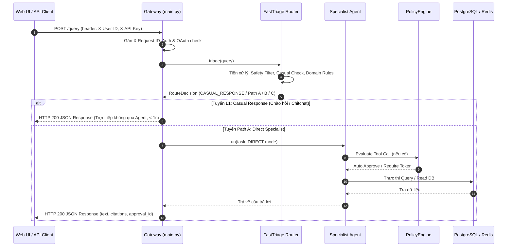

# TẬP 1: TỔNG QUAN KIẾN TRÚC HỆ THỐNG & HẠ TẦNG (SYSTEM OVERVIEW & INFRASTRUCTURE)

> **Cấp độ tài liệu**: Sách tham khảo kỹ thuật chuyên sâu - Tập 1/6 (Technical Architecture Manual - Volume 1).
> **Trạng thái hệ thống**: P0–P14 đã nghiệm thu & đóng (`CLOSED`), Phase 15 (`FastTriage & Static Workflows`) hoàn thiện.

---

## 1. TRIẾT LÝ THIẾT KẾ CỐT LÕI (CORE DESIGN PHILOSOPHY)

Hệ thống Trợ lý AI Cá nhân (Personal AI Assistant) được thiết kế để giải quyết 3 thách thức lớn nhất trong ứng dụng AI doanh nghiệp:
1. **Bùng nổ Latency & Chi phí Token**: Khi môt câu hỏi đơn giản cũng phải đi qua Supervisor LLM để phân tích, dẫn đến thời gian phản hồi kéo dài (5–10s) và tiêu tốn quá nhiều LLM Tokens.
2. **Ảo giác tri thức (Hallucination)**: Khi LLM đoán mò câu trả lời do không có thông tin nội bộ hoặc do tìm kiếm RAG bị nhiễu.
3. **Nguy cơ rủi ro an toàn dữ liệu**: Khi AI được cấp quyền tự động gửi email, sửa lịch hoặc xóa file trên Google Drive mà không có kiểm soát.

👉 **Tuyên ngôn kiến trúc cốt lõi**:
> *"Multi-Agent is a capability boundary, not an execution requirement"*
> (Đa tác tử là ranh giới phân định năng lực và bảo mật, không phải là yêu cầu bắt buộc cho mọi luồng thực thi).

---

## 2. SƠ ĐỒ KIẾN TRÚC TỔNG THỂ 6 TẦNG (END-TO-END SYSTEM ARCHITECTURE)

---

## 3. PHÂN TÍCH CHI TIẾT CÁC TẦNG HẠ TẦNG (INFRASTRUCTURE & CORE SERVICES)

### 3.1. Tầng 1: API Gateway & Middleware Framework (`app/main.py`)

* **Nhiệm vụ**: Quản lý điểm tiếp nhận HTTP Request, khởi tạo Context tracking và xác thực OAuth.
* **Cơ chế hoạt động**:
  1. **Correlation Tracing**: Mỗi request đi qua FastAPI Middleware sẽ được tiêm một chuỗi định danh duy nhất `X-Request-ID` (UUIDv4). Mã này được bind vào đối tượng `Structlog` context. Tất cả các thành phần downstream (Router, Agents, Tool Executors, DB Queries) đều mang vết `request_id` này trong log.
  2. **FastAPI Exception Handlers**: Bắt các ngoại lệ chuẩn hóa (`DomainError`, `ValidationError`, `PermissionDeniedError`) và chuyển đổi thành HTTP JSON response có cấu trúc nhất quán.
  3. **Google OAuth Subpackage ([`app/services/google/auth/`](file:///d:/Code/personal_ai_assistant/app/services/google/auth/))**: 
     - Quản lý vòng đời xác thực Google OAuth độc lập thông qua `GoogleOAuthService` (`service.py`), `GoogleOAuthClient` (`client.py`), `GoogleScopeValidator` và `GoogleTokenSet` (`tokens.py`).
     - Hỗ trợ lưu trữ state phiên OAuth an toàn với `InMemoryOAuthStateStore` và `RedisOAuthStateStore` (`state_store.py`).
     - Tự động dùng `refresh_token` xin token mới nếu access token hết hạn trước khi gọi Google API.

### 3.2. Tầng 2: MemoryGate, Routing & Query Orchestration

* **MemoryGate & Context Preparation ([`app/services/context/`](file:///d:/Code/personal_ai_assistant/app/services/context/))**:
  - **Short-term Memory (Redis 7)**: Danh sách tin nhắn theo `session_id`, TTL 24h.
  - **Long-term Memory (PostgreSQL pgvector)**: Vector similarity search qua Cosine Distance (`<=>`), tiêm trực tiếp vào system context của agent.
* **Query Orchestration Subpackage ([`app/services/routing/query/`](file:///d:/Code/personal_ai_assistant/app/services/routing/query/))**:
  - Module hóa thành package độc lập thay cho file đơn cồng kềnh trước đây:
    - [`orchestrator.py`](file:///d:/Code/personal_ai_assistant/app/services/routing/query/orchestrator.py): Class `QueryOrchestrator` điều phối toàn diện pipeline xử lý yêu cầu ngôn ngữ tự nhiên từ endpoint `POST /query`.
    - [`models.py`](file:///d:/Code/personal_ai_assistant/app/services/routing/query/models.py): Định nghĩa cấu trúc `QueryResult`, `QueryRouteInfo`, các interface factory và callback types.
    - [`parsing.py`](file:///d:/Code/personal_ai_assistant/app/services/routing/query/parsing.py): Xử lý bóc tách cửa sổ thời gian lịch (`infer_calendar_window`), phân tích giờ hẹn tiếng Việt (`parse_event_times`), phân tích câu lệnh Gmail search.
    - [`email_synthesis.py`](file:///d:/Code/personal_ai_assistant/app/services/routing/query/email_synthesis.py): Soạn thảo bản nháp email (`compose_email_draft`) và tóm tắt hòm thư (`summarize_emails`, `summarize_emails_stream`) với cơ chế heuristic fallback khi LLM offline.

### 3.3. Tầng 6: Infrastructure & Storage Engine

* **PostgreSQL 16 (với pgvector extension)**:
  * Đóng vai trò vừa là CSDL Quan hệ (ACID) vừa là CSDL Vector.
  * Hỗ trợ chỉ mục **HNSW** (`vector_cosine_ops`) cho tìm kiếm ngữ nghĩa siêu tốc.
  * Hỗ trợ chỉ mục **GIN** trên cột `tsvector` cho tìm kiếm từ khóa Full-Text Search với từ điển tiếng Việt `vietnamese_simple`.
* **Redis 7 (Alpine)**:
  * Đóng vai trò Cache tầng thấp, Session Store và Distributed Lock (`Redlock`) để tránh tranh chấp khi ghi dữ liệu song song.
* **Local ML Engine**:
  * Chạy trực tiếp trên môi trường Server mà không gọi API ngoài:
    * Embedding Model: `AITeamVN/Vietnamese_Embedding` (1024 dimensions, L2-normalized).
    * Reranker Model: `namdp-ptit/ViRanker` (Cross-Encoder đánh giá điểm tương quan query-chunk).

### 3.4. Chuẩn Mực Kiến Trúc Mã Nguồn (Codebase Modularity & Subpackages)

Để đảm bảo hệ thống dễ đọc, dễ bảo trì và dễ mở rộng khi phát triển lâu dài:
1. **Giới hạn độ dài file mã nguồn (Hard limit $\le 800$ dòng)**:
   - 100% các file mã nguồn trong thư mục `app/` đều tuân thủ nghiêm ngặt giới hạn $\le 800$ dòng code. Các module lớn vượt ngưỡng đều được tách thành các subpackage chuyên biệt.
2. **Quy hoạch thư mục con (Subpackages) & Re-export sạch sẽ**:
   - [`app/services/routing/query/`](file:///d:/Code/personal_ai_assistant/app/services/routing/query/): Gom cụm toàn bộ logic xử lý query orchestration.
   - [`app/services/google/auth/`](file:///d:/Code/personal_ai_assistant/app/services/google/auth/): Gom cụm toàn bộ logic Google OAuth và token management.
   - [`app/integrations/google_drive/`](file:///d:/Code/personal_ai_assistant/app/integrations/google_drive/): Tách biệt `adapter.py` và `parsing.py` cho Google Drive API.
   - [`app/integrations/google_gmail/`](file:///d:/Code/personal_ai_assistant/app/integrations/google_gmail/): Tách biệt `adapter.py` và `parsing.py` cho Gmail API.
   - Mỗi subpackage đều có `__init__.py` re-export đầy đủ public contracts, đảm bảo **100% tính tương thích ngược** với các caller bên ngoài.
3. **Chuẩn mực Import (PEP 8 & Top-level Imports)**:
   - Toàn bộ dependencies được khai báo rõ ràng ở top-level, loại bỏ triệt để các inline/delayed imports rải rác bên trong hàm.
   - Sử dụng relative import nội bộ (`from .models import ...`, `from .parsing import ...`) bên trong subpackage.

---

## 4. QUY TRÌNH XỬ LÝ MỘT REQUEST THỰC TẾ (END-TO-END REQUEST LIFECYCLE)

---

*Xem tiếp chi tiết 3 Tuyến thực thi tại Tập 2: [`02-execution-paths-and-routing.md`](file:///d:/Code/personal_ai_assistant/docs/architecture/02-execution-paths-and-routing.md)*
