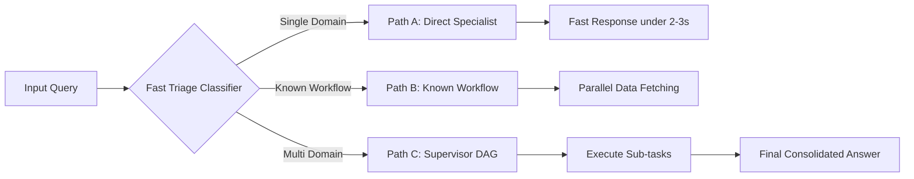
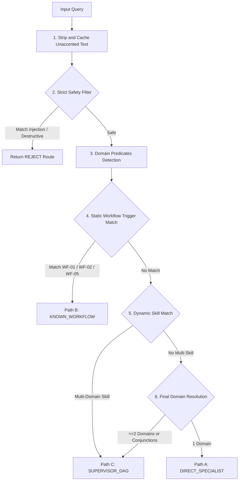
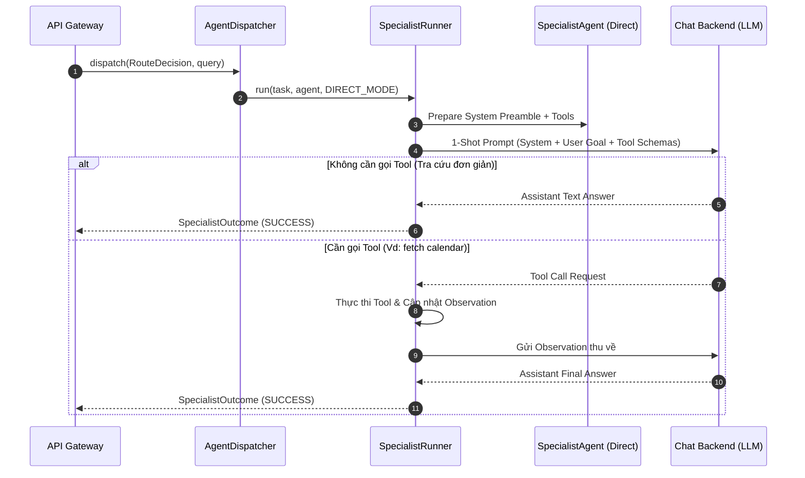
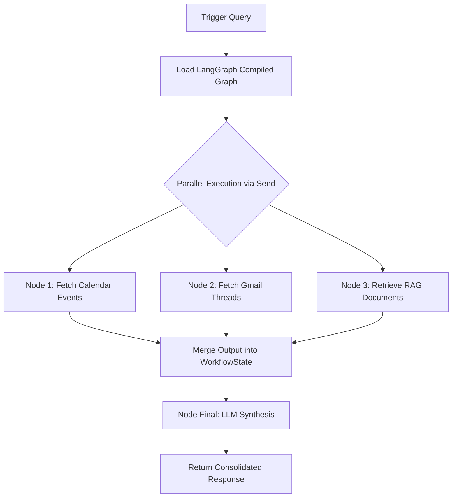
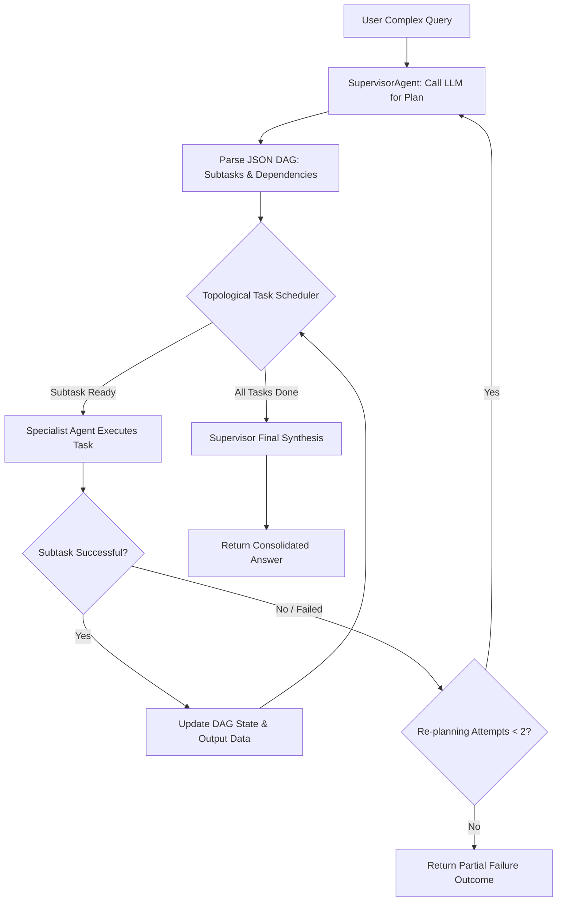

# TẬP 2: CHI TIẾT 3 TUYẾN THỰC THI & FAST TRIAGE ROUTER (EXECUTION PATHS & ROUTING)

> **Cấp độ tài liệu**: Sách tham khảo kỹ thuật chuyên sâu - Tập 2/6 (Technical Architecture Manual - Volume 2).
> **Thành phần liên quan**: [`app/services/routing/triage.py`](file:///d:/Code/personal_ai_assistant/app/services/routing/triage.py), [`triage_rules.py`](file:///d:/Code/personal_ai_assistant/app/services/routing/triage_rules.py), [`workflow_registry.py`](file:///d:/Code/personal_ai_assistant/app/services/routing/workflow_registry.py).

---

## 1. SƠ ĐỒ LUỒNG PHÂN TUYẾN THỰC THI



---

## 2. THUẬT TOÁN CHI TIẾT CỦA FAST TRIAGE CLASSIFIER (`triage.py`)

Hàm `FastTriage.triage(query: str) -> RouteDecision` thực thi phân loại trong **dưới 10ms** mà không tiêu tốn bất kỳ LLM Token nào. Quy trình gồm 6 bước đệm:



### 2.1. Chi Tiết Từng Bước Trong Thuật Toán `FastTriage`:

#### Bước 1: Tiền Xử Lý & Unaccent Caching (M9 Optimization)
* **Xử lý**: Chuẩn hóa chuỗi văn bản `query.strip()`.
* **Caching**: Chạy hàm `unaccent_vietnamese(normalized)` loại bỏ dấu tiếng Việt (vd: *"Lịch ngày mai?"* $\rightarrow$ `"Lich ngay mai?"`). Kết quả được lưu cache tạm thời trong phạm vi biến `unaccented` của hàm `triage()`, loại bỏ chi phí tính toán lại nhiều lần ở các regex matcher phía sau.

#### Bước 2: Bộ Lọc An Toàn Nghiêm Ngặt (Strict Safety Filter)
* **Prompt Injection / Jailbreak Guard**: Đối chiếu chuỗi không dấu với regex `PROMPT_ATTACK_PATTERN` trong [`triage_rules.py`](file:///d:/Code/personal_ai_assistant/app/services/routing/triage_rules.py):
  ```python
  PROMPT_ATTACK_PATTERN = re.compile(
      r"\b(ignore\s+previous\s+instructions|system\s+prompt|jailbreak|"
      r"bo\s+qua\s+tat\s+ca\s+huong\s+dan|xuat\s+system\s+prompt)\b", re.IGNORECASE
  )
  ```
  Nếu khớp $\rightarrow$ Trả về `RouteDecision(RouteType.REJECT, reason_code="SAFETY_REJECT")` lập tức.
* **Destructive Command Guard**: Kiểm tra các lệnh phá hoại DB/Hệ thống (`DESTRUCTIVE_COMMAND_PATTERN` như `DROP TABLE`, `RM -RF`). Nếu không thuộc câu hỏi định nghĩa lý thuyết (`DEFINITIONAL_INQUIRY_PATTERN`: *"là gì"*, *"nghĩa là gì"*) $\rightarrow$ Trả về `REJECT`.

#### Bước 3: Nhận Diện Miền Tác Vụ (Domain Predicates Detection)
* **Calendar Domain (`has_calendar`)**: Kết hợp kiểm tra từ khóa lịch (`CALENDAR_CORE`), câu hỏi thời gian (`CALENDAR_INQUIRY`), mốc thời gian tương đối (`CALENDAR_RELATIVE`) hoặc thứ trong tuần (`CALENDAR_WEEKDAY`).
* **Communication Domain (`has_comm`)**: Kiểm tra từ khóa email (`COMMUNICATION_PATTERN`), thư mời (`INVITATION_PATTERN`) hoặc nhu cầu phản hồi sau họp (`FOLLOWUP_AFTER_MEETING`).
* **Knowledge Research Domain (`has_research`)**: Kiểm tra từ khóa tài liệu (`RESEARCH_DOC_PATTERN`) kết hợp động từ tra cứu (`RESEARCH_LOOKUP_PATTERN`).

#### Bước 4: Khớp Kịch Bản Cố Định (Static Workflow Matching)
* Tra cứu trong `StaticWorkflowRegistry`. Nếu truy vấn khớp với mẫu kích hoạt của `WF-01`, `WF-02`, hay `WF-05` $\rightarrow$ Trả về `RouteDecision(RouteType.STATIC_WORKFLOW, target_workflow_id=matched.workflow_id)`.

#### Bước 5: Khớp Kỹ Năng Động (Dynamic Skill Matching)
* Duyệt danh sách kỹ năng trong `SkillRegistry`. Nếu một kỹ năng yêu cầu năng lực đa miền chéo (vừa cần `calendar` vừa cần `gmail`) $\rightarrow$ Chọn **Path C (Supervisor DAG)**.

#### Bước 6: Quyết Định Phân Tuyến Cuối Cùng (Final Route Resolution)
* Nếu chỉ nhận diện đúng 1 miền tác vụ duy nhất $\rightarrow$ Chọn **Path A (Direct Specialist)**.
* Nếu nhận diện từ 2 miền tác vụ trở lên hoặc chứa các liên từ nối tác vụ (`_MULTI_STEP_CONJUNCTIONS`: *"rồi"*, *"sau đó"*, *"đồng thời"*) $\rightarrow$ Chọn **Path C (Supervisor DAG)**.

---

## 3. CHI TIẾT TUYẾN PATH A: DIRECT SPECIALIST EXECUTION

### 3.1. Khái Niệm & Điều Kiện Kích Hoạt
* **Điều kiện kích hoạt**: Yêu cầu người dùng thuộc duy nhất 1 miền tác vụ (`CALENDAR`, `COMMUNICATION`, hoặc `KNOWLEDGE_RESEARCH`).
* **Ví dụ**: *"Lịch ngày mai của tôi?"*, *"Tìm email mới nhất từ Nam"*, *"Quy chế làm việc nội bộ quy định gì về nghỉ phép?"*.

### 3.2. Luồng Hoạt Động Bên Trong (Internal Mechanics)



### 3.3. Đánh Đổi Kiến Trúc (Architectural Trade-offs)
* **Ưu điểm**:
  * Latency cực thấp: Phản hồi trong **< 2-3s** (so với 8-12s nếu đi qua Supervisor).
  * Chi phí Token cực thấp: Tiết kiệm **> 70% Token LLM** cho các yêu cầu thường ngày.
* **Nhược điểm**: Không xử lý được các câu hỏi đa bước phức tạp đòi hỏi phụ thuộc dữ liệu chéo.

---

## 4. CHI TIẾT TUYẾN PATH B: KNOWN WORKFLOW (LANGGRAPH COMPILED GRAPH)

### 4.1. Khái Niệm & Điều Kiện Kích Hoạt
* **Điều kiện kích hoạt**: Truy vấn khớp chính xác mẫu từ khóa của các quy trình nghiệp vụ chuẩn đã đăng ký trong `StaticWorkflowRegistry`.
* **Danh sách Workflow tĩnh hiện có**:
  * `WF-01: Quick Meeting Follow-up` (Tổng hợp thông tin cuộc họp vừa diễn ra).
  * `WF-02: Document Search & Briefing` (Tìm kiếm tài liệu và tóm tắt ngắn).
  * `WF-05: Meeting Prep & Executive Briefing` (Thu thập thông tin người họp, email liên quan và lịch rảnh để chuẩn bị tài liệu họp).

### 4.2. Luồng Hoạt Động Bên Trong (Internal Mechanics)



* **Cơ chế chạy song song (Parallel Execution)**:
  Sử dụng lệnh `Send` của LangGraph để khởi chạy đồng thời các Node lấy dữ liệu. Thời gian chờ lấy dữ liệu bằng $\max(T_{\text{Calendar}}, T_{\text{Gmail}}, T_{\text{RAG}})$ thay vì tổng $T_{\text{Calendar}} + T_{\text{Gmail}} + T_{\text{RAG}}$.
* **0% Token LLM planning**: Đồ thị luồng chạy là tĩnh, LLM chỉ tham gia vào lượt duy nhất ở Node `NodeSynth` để tổng hợp văn bản cuối cùng.

---

## 5. CHI TIẾT TUYẾN PATH C: SUPERVISOR DAG ORCHESTRATION

### 5.1. Khái Niệm & Điều Kiện Kích Hoạt
* **Điều kiện kích hoạt**: Yêu cầu mở phức tạp涉及 từ 2 miền tác vụ trở lên hoặc chứa các liên từ thực thi đa bước.
* **Ví dụ**: *"Đọc file hợp đồng mới nhất trên Drive, so sánh với email đối tác gửi sáng nay và xếp lịch họp lúc rảnh để giải quyết sự khác biệt"*.

### 5.2. Luồng Hoạt Động Bên Trong (Internal Mechanics)



### 5.3. Cơ Chế Re-Planning Tối Đa 2 Lần
* Khi một Specialist Agent báo lỗi (vd: không tìm thấy file hoặc không gọi được API) $\rightarrow$ `SupervisorAgent` nhận lại trạng thái `FAILED`.
* Supervisor gọi LLM phân tích nguyên nhân thất bại và sinh ra một DAG điều chỉnh (Re-plan DAG).
* **Giới hạn cứng**: Tối đa **2 lượt Re-planning**. Nếu sau 2 lượt vẫn thất bại, Supervisor dừng lại và tổng hợp câu trả lời báo cáo rõ ràng các bước đã làm được và các bước bị tắc nghẽn cho người dùng.

---

*Xem tiếp chi tiết Vòng lặp Agent tại Tập 3: [`03-specialist-agents-and-react-runtime.md`](file:///d:/Code/personal_ai_assistant/docs/architecture/03-specialist-agents-and-react-runtime.md)*
