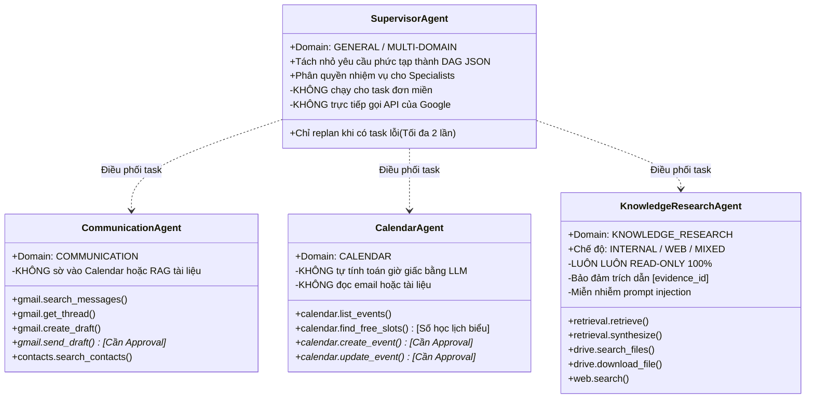
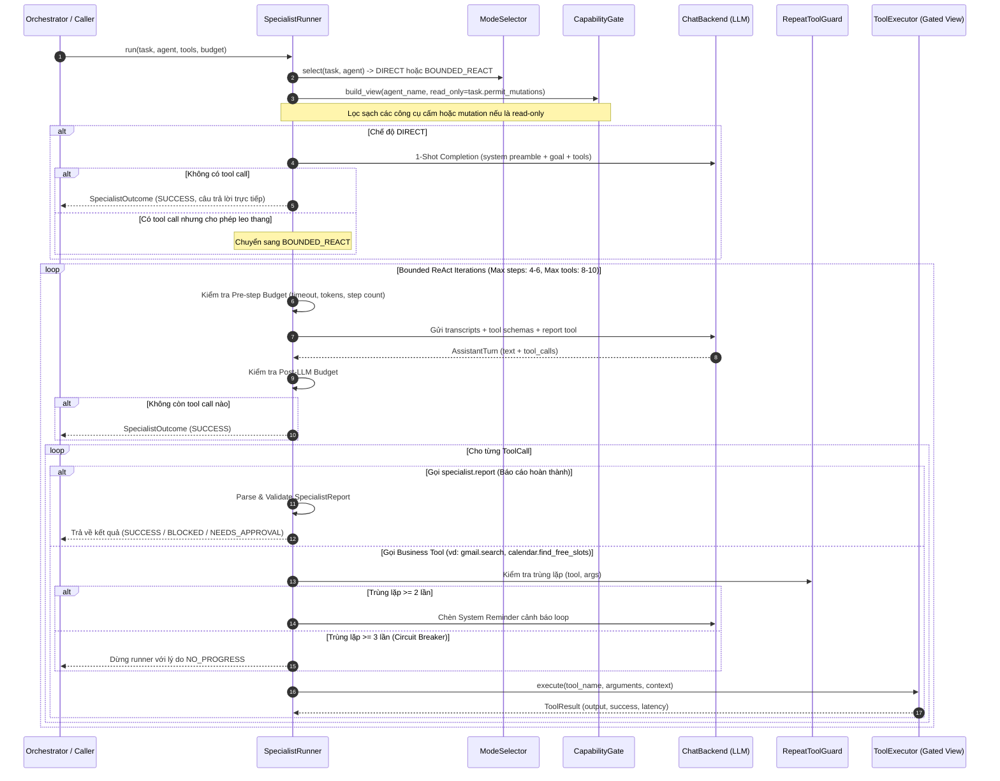

# TẬP 3: SPECIALIST AGENTS & BOUNDED REACT RUNTIME (SPECIALIST RUNTIME)

> **Cấp độ tài liệu**: Sách tham khảo kỹ thuật chuyên sâu - Tập 3/6 (Technical Architecture Manual - Volume 3).
> **Thành phần liên quan**: [`app/agents/specialist/react.py`](file:///d:/Code/personal_ai_assistant/app/agents/specialist/react.py), [`guard.py`](file:///d:/Code/personal_ai_assistant/app/agents/specialist/guard.py), [`declarations.py`](file:///d:/Code/personal_ai_assistant/app/agents/declarations.py).

---

## 1. RANH GIỚI TRÁCH NHIỆM CỦA 4 SPECIALIST AGENTS (AGENT BOUNDARIES)

Hệ thống tuân thủ nghiêm ngặt nguyên tắc phân định năng lực (Least Privilege). Mỗi Agent chỉ được sở hữu các công cụ thuộc miền tác vụ của mình:

---

## 2. SEQUENCE DIAGRAM: BOUNDED REACT SPECIALIST RUNNER (`react.py`)

Tất cả các Specialist Agent đều được điều phối vận hành bởi `SpecialistRunner`:

---

## 3. THUẬT TOÁN Anti-Loop CIRCUIT BREAKER (`guard.py`)

### 3.1. Đặt Vấn Đề
Trong luồng ReAct (Reason + Act), các mô hình LLM có nguy cơ rơi vào trạng thái kẹt lặp (Infinite Tool Loop): LLM gọi một công cụ, nhận về kết quả lỗi hoặc rỗng, nhưng ở bước tiếp theo lại tiếp tục gọi lại chính công cụ đó với bộ tham số y hệt. Việc này gây lãng phí token và làm đơ hệ thống.

### 3.2. Thuật Toán `RepeatToolGuard` Chi Tiết

1. **Tính toán Hash nguyên tử**:
   Mỗi khi LLM sinh một `ToolCall(name, args)`, `RepeatToolGuard` chuẩn hóa dictionary `args` (sắp xếp key) và tính toán chuỗi băm MD5:
   $$\text{ToolHash} = \text{MD5}(\text{tool\_name} + \text{json\_dumps}(\text{sorted\_args}))$$

2. **Theo dõi tần suất (Frequency Tracking)**:
   Hệ thống lưu lịch sử các `ToolHash` trong phạm vi lượt chạy của Agent.

3. **Xử lý các ngưỡng trùng lặp**:
   * **Ngưỡng trùng = 1**: Cho phép thực thi bình thường.
   * **Ngưỡng trùng = 2 (Reminder Warning)**:
     Thực thi tool, nhưng ở lượt gọi LLM tiếp theo, Runner chủ động chèn thêm một thông điệp System Reminder vào transcript:
     > *"Cảnh báo hệ thống: Bạn đã gọi công cụ '{tool_name}' với cùng bộ tham số 2 lần liên tiếp mà không có tiến triển mới. Bạn PHẢI thay đổi giá trị tham số hoặc sử dụng một công cụ khác."*
   * **Ngưỡng trùng = 3 (Circuit Breaker)**:
     Kích hoạt ngắt mạch khẩn cấp! Runner dừng vòng lặp ReAct ngay lập tức và trả về `SpecialistOutcome(status=NO_PROGRESS, reasoning="Circuit breaker triggered: Tool called with identical arguments 3 times.")`.

---

## 4. QUẢN LÝ NGÂN SÁCH THỰC THI (BUDGET & RUNTIME LIMITS)

Mọi lượt chạy của `SpecialistRunner` đều được kiểm soát bởi đối tượng `ExecutionBudget`:

| Tham Số Ngân Sách | Giá Trị Mặc Định | Hành Động Khi Vượt Ngưỡng |
| :--- | :--- | :--- |
| `max_steps` | 4–6 bước | Dừng ReAct loop, chuyển sang bước tổng hợp cuối với thông báo hoàn thành một phần. |
| `max_tool_calls` | 8–10 lượt | Cấm LLM phát sinh thêm tool call mới; bắt buộc dùng dữ liệu đã có để trả lời. |
| `timeout_seconds` | 30 giây | Ném ngoại lệ `TimeoutError`, hủy bỏ các task async đang chờ. |
| `max_tokens` | 4,000 tokens | Ngắt lượt gọi LLM và cảnh báo tràn bộ nhớ ngữ cảnh. |

---

*Xem tiếp chi tiết An toàn & Phê duyệt tại Tập 4: [`04-security-policy-engine-and-hitl.md`](file:///d:/Code/personal_ai_assistant/docs/architecture/04-security-policy-engine-and-hitl.md)*
