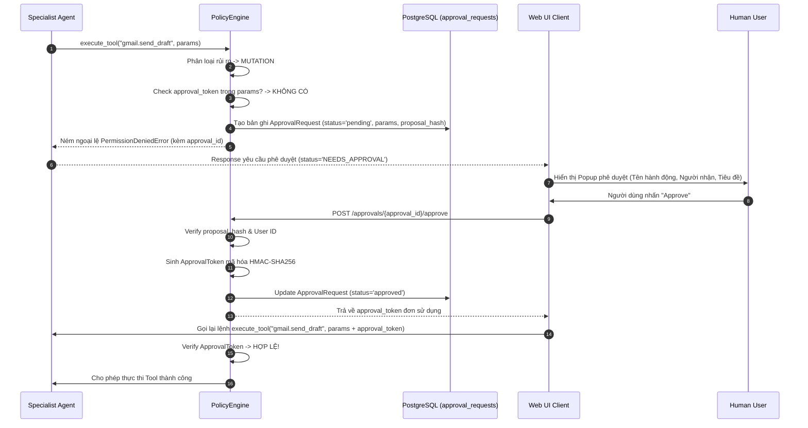
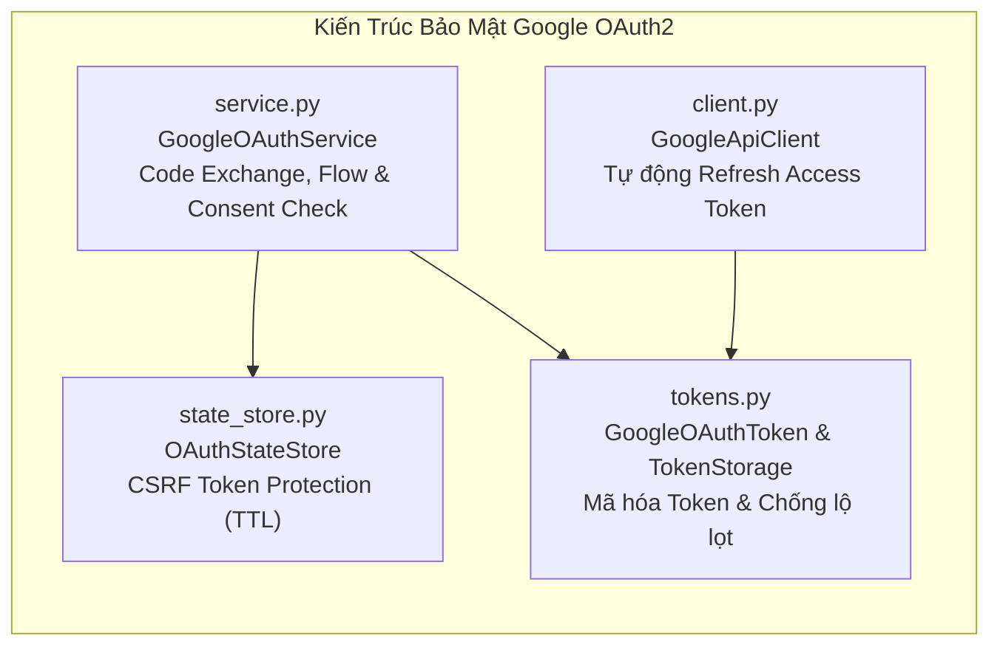

# TẬP 4: BẢO MẬT, POLICY ENGINE & HUMAN-IN-THE-LOOP (SECURITY & HITL)

> **Cấp độ tài liệu**: Sách tham khảo kỹ thuật chuyên sâu - Tập 4/6 (Technical Architecture Manual - Volume 4).
> **Thành phần liên quan**: [`app/services/approvals/`](file:///d:/Code/personal_ai_assistant/app/services/approvals), [`CapabilityGate`](file:///d:/Code/personal_ai_assistant/app/agents/specialist/guard.py), [`app/services/google/auth/`](file:///d:/Code/personal_ai_assistant/app/services/google/auth).

---

## 1. PHÂN LOẠI 4 NHÓM RỦI RO HÀNH ĐỘNG TOOL (ACTION RISK CLASSIFICATION)

Mọi công cụ (Tool) trong hệ thống đều phải đăng ký cấp độ rủi ro tác động dữ liệu. `PolicyEngine` dựa vào cấp độ này để quyết định có cho phép thực thi tự động hay bắt buộc phải qua phê duyệt của con người (Human-in-the-Loop).

```mermaid
flowchart TD
    subgraph ActionClass["1. Phân Loại Hành Động Tool"]
        Read["READ / READ_ONLY\n(gmail.search, calendar.list)"]
        SafeWrite["SAFE_WRITE / LOW_IMPACT\n(gmail.create_draft)"]
        Mutation["MUTATION / HIGH_IMPACT\n(gmail.send_draft, calendar.delete)"]
        Destructive["DESTRUCTIVE\n(drive.delete_file, gmail.trash)"]
    end

    subgraph PolicyEval["2. PolicyEngine Evaluation"]
        Read & SafeWrite --> AutoApprove["AUTO_APPROVE\nCho phép thực thi ngay"]
        Mutation & Destructive --> CheckToken{Kiểm tra Approval Token\nhoặc approval_id}
        CheckToken -->|Có Token hợp lệ| AllowExec["Cho phép thực thi Tool"]
        CheckToken -->|Không có Token / Hết hạn| Block["Chặn thực thi Tool\nTạo ApprovalRequest (Pending)"]
    end

    subgraph UserHITL["3. Tương tác Người Dùng (HITL)"]
        Block --> UI["Web UI / Client\nHiển thị thông tin hành động & rủi ro"]
        UI --> Decision{Người dùng quyết định}
        Decision -->|Đồng ý (Approve)| GenToken["Sinh Approval Token\nTiếp tục tiến trình Task"]
        Decision -->|Từ chối (Reject)| Cancel["Hủy Task / Báo lỗi PermissionDenied"]
        GenToken --> AllowExec
    end
```

### 1.1. Chi Tiết 4 Cấp Độ Rủi Ro:

1. **`READ / READ_ONLY`**:
   * *Đặc điểm*: Chỉ đọc dữ liệu, không làm thay đổi trạng thái hệ thống.
   * *Ví dụ*: `gmail.search_messages`, `calendar.list_events`, `retrieval.retrieve`, `drive.search_files`.
   * *Chính sách*: **AUTO_APPROVE** (Cho phép thực thi ngay lập tức).

2. **`SAFE_WRITE / LOW_IMPACT`**:
   * *Đặc điểm*: Ghi dữ liệu tạm thời/bản nháp nội bộ, không phát tán ra ngoài và có thể sửa/xóa dễ dàng.
   * *Ví dụ*: `gmail.create_draft` (Tạo thư nháp trong Gmail).
   * *Chính sách*: **AUTO_APPROVE** (Cho phép thực thi ngay lập tức).

3. **`MUTATION / HIGH_IMPACT`**:
   * *Đặc điểm*: Tác động trực tiếp làm thay đổi trạng thái dữ liệu thật hoặc phát tán thông tin ra bên ngoài.
   * *Ví dụ*: `gmail.send_draft` (Gửi email), `calendar.create_event` (Tạo lịch thật), `calendar.update_event`.
   * *Chính sách*: **REQUIRES_HUMAN_APPROVAL** (Bắt buộc người dùng nhấn Approve).

4. **`DESTRUCTIVE / IRREVERSIBLE`**:
   * *Đặc điểm*: Hành động xóa hoặc đè dữ liệu không thể khôi phục.
   * *Ví dụ*: `drive.delete_file`, `gmail.trash_message`, `calendar.delete_event`.
   * *Chính sách*: **REQUIRES_HUMAN_APPROVAL** (Bắt buộc người dùng nhấn Approve kèm cảnh báo nguy hiểm đỏ).

---

## 2. QUY TRÌNH PHÊ DUYỆT HUMAN-IN-THE-LOOP (HITL WORKFLOW)



---

## 3. CƠ CHẾ BẢO MẬT & MÃ HÓA APPROVAL TOKEN

### 3.1. Thuật Toán Sinh Token (`ApprovalToken`)
Để đảm bảo người dùng không thể giả mạo chữ ký duyệt hoặc tái sử dụng (Replay Attack) token duyệt:
1. Server tạo một chuỗi băm đề xuất (Proposal Hash):
   $$\text{ProposalHash} = \text{SHA256}(\text{run\_id} + \text{tool\_name} + \text{json\_dumps}(\text{sorted\_params}))$$
2. Khi người dùng nhấn Approve, Server sinh ra `ApprovalToken` bằng mã hóa HMAC-SHA256 sử dụng khóa bí mật `SECURITY__APPROVAL_SIGNING_KEY`:
   $$\text{ApprovalToken} = \text{HMAC-SHA256}(\text{ProposalHash} + \text{user\_id} + \text{expire\_timestamp}, \text{SecretKey})$$
3. Token này có thời hạn sống ngắn (**TTL = 5 phút**) và được đánh dấu đã sử dụng trong Redis ngay sau khi Tool Executor xác thực thành công (Single-use Token).

---

## 4. CAPABILITY GATE & NGUYÊN TẮC LEAST PRIVILEGE

`CapabilityGate` đóng vai trò là một màng lọc công cụ động:
* **Filtered Tool View**: Trước khi giao danh sách Tool Schema cho LLM, `CapabilityGate` lọc sạch các công cụ không thuộc miền tác vụ của Agent đó.
* **Read-Only Enforcement**: Nếu một Task được đánh dấu `permit_mutations = False` (chế độ tra cứu an toàn), `CapabilityGate` sẽ loại bỏ toàn bộ các công cụ loại `MUTATION` và `DESTRUCTIVE` khỏi danh sách Schema, ngăn LLM nảy sinh ý định gọi công cụ ghi dữ liệu ngay từ vòng nhắc (Prompting level).

---

## 5. QUẢN LÝ XÁC THỰC OAUTH2 GOOGLE & BẢO MẬT TOKEN (`app/services/google/auth/`)

Nhằm tuân thủ nguyên tắc giới hạn kích thước tệp $\le 800$ dòng để bảo đảm khả năng kiểm toán an ninh (Security Auditing) độc lập, hệ thống xác thực Google OAuth2 được mô-đun hóa thành các thành phần chuyên biệt:



1. **Phòng chống tấn công CSRF ([`state_store.py`](file:///d:/Code/personal_ai_assistant/app/services/google/auth/state_store.py))**:
   * Mỗi phiên ủy quyền OAuth2 bắt đầu với một chuỗi `state` ngẫu nhiên bảo mật cao được lưu trong `OAuthStateStore` kèm TTL (thời hạn hiệu lực).
   * Khi Google callback trở về, `state` bắt buộc phải khớp và chỉ được dùng một lần (Single-use) trước khi tiến hành đổi `code` lấy token.

2. **Bảo mật lưu trữ & mã hóa Token ([`tokens.py`](file:///d:/Code/personal_ai_assistant/app/services/google/auth/tokens.py))**:
   * Lưu trữ `GoogleOAuthToken` tách biệt an toàn, hỗ trợ mã hóa các trường nhạy cảm như `refresh_token`.
   * Cung cấp interface `TokenStorage` (hỗ trợ Persistent DB Store và `InMemoryTokenStore` cho môi trường kiểm thử/cục bộ).

3. **Tự động gia hạn Access Token ([`client.py`](file:///d:/Code/personal_ai_assistant/app/services/google/auth/client.py))**:
   * `GoogleApiClient` kiểm tra thời hạn sống của `access_token` trước mỗi yêu cầu HTTP đến Google API (Gmail, Drive, Calendar).
   * Nếu token sắp hết hạn hoặc gặp lỗi `401 Unauthorized`, client tự động dùng `refresh_token` để xin token mới và cập nhật lại vào `TokenStorage` mà không làm gián đoạn phiên làm việc của người dùng.

---

*Xem tiếp chi tiết Pipeline Ingestion tại Tập 5: [`05-document-ingestion-pipeline.md`](file:///d:/Code/personal_ai_assistant/docs/architecture/05-document-ingestion-pipeline.md)*
