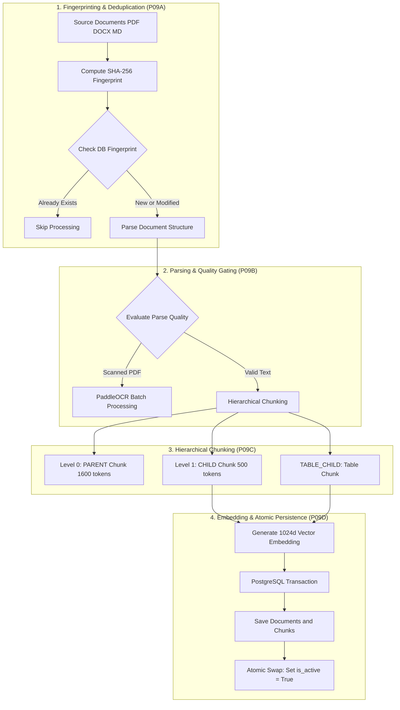
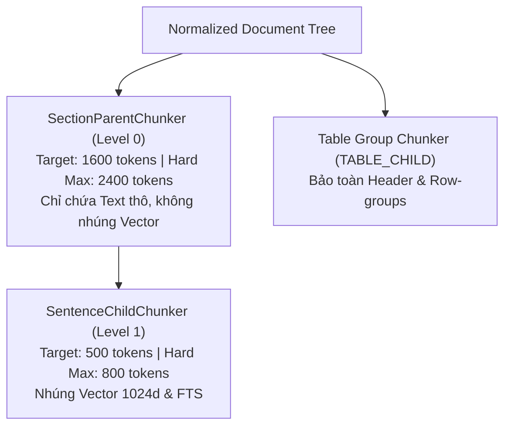

# TẬP 5: PIPELINE NẠP & ĐÁNH CHỈ MỤC TÀI LIỆU (DOCUMENT INGESTION PIPELINE - P09)

> **Cấp độ tài liệu**: Sách tham khảo kỹ thuật chuyên sâu - Tập 5/6 (Technical Architecture Manual - Volume 5).
> **Thành phần liên quan**: [`app/services/ingestion/orchestrator.py`](file:///d:/Code/personal_ai_assistant/app/services/ingestion/orchestrator.py), [`fingerprint.py`](file:///d:/Code/personal_ai_assistant/app/services/ingestion/fingerprint.py), [`parsing/`](file:///d:/Code/personal_ai_assistant/app/services/ingestion/parsing), [`chunking/`](file:///d:/Code/personal_ai_assistant/app/services/ingestion/chunking), [`persistence.py`](file:///d:/Code/personal_ai_assistant/app/services/ingestion/persistence.py).

---

## 1. SƠ ĐỒ LUỒNG PIPELINE INGESTION (P09 END-TO-END)



---

## 2. CHI TIẾT KỸ THUẬT 4 BƯỚC XỬ LÝ INGESTION

### 2.1. Bước 1: Fingerprinting & Deduplication (`fingerprint.py`)

* **Nhiệm vụ**: Đảm bảo tính chống lặp (Idempotency), loại bỏ hoàn toàn việc re-index các tập tin không bị chỉnh sửa.
* **Cơ chế tính toán**:
  Mã Fingerprint được tạo ra từ chuỗi băm tổng hợp 5 thành phần:
  $$\text{Fingerprint} = \text{SHA256}(\text{source\_id} + \text{content\_hash} + \text{parser\_ver} + \text{chunker\_ver} + \text{model\_ver})$$
  * `source_id`: Định danh duy nhất của nguồn (vd: Path hoặc Drive File ID).
  * `content_hash`: Băm SHA-256 của nội dung file thô.
  * `parser_ver`: Phiên bản mã nguồn bộ Parser (`markdown_v1` hoặc `docling_v2`).
  * `chunker_ver`: Phiên bản bộ cắt chunk (`parent_v1_child_v1`).
  * `model_ver`: Phiên bản mô hình embedding (`Vietnamese_Embedding_v1`).
* **Quy trình kiểm tra**:
  `IngestionOrchestrator` gọi `fingerprint_matches_stored()`. Nếu vân tay trùng khớp trong DB $\rightarrow$ Trả về `IngestionStatus.SKIPPED`, tiết kiệm 100% thời gian xử lý CPU/GPU.

---

### 2.2. Bước 2: Parsing & Parse Quality Gating (`parsing/`)

* **Nhiệm vụ**: Trích xuất tài liệu thô thành cây cấu trúc chuẩn hóa `NormalizedDocumentTree`.
* **Parser Selection**:
  * Tập tin Markdown (`.md`) $\rightarrow$ Chạy `MarkdownDocumentParser`.
  * Tập tin PDF/DOCX $\rightarrow$ Chạy `DoclingParser`.
* **Evaluation & Offline OCR Path (`scripts/ocr_batch.py`)**:
  * Hàm `evaluate_parse_quality()` kiểm tra mật độ từ vựng và tỷ lệ ký tự rác.
  * Nếu phát hiện file PDF là **trang scan dạng hình ảnh không có text layer** $\rightarrow$ Hệ thống gán trạng thái `NEEDS_OCR` và đẩy file vào hàng đợi offline batch `scripts/ocr_batch.py`.
  * Tiến trình batch chạy mô hình **PaddleOCR-VL-1.6 GGUF** trích xuất chữ và bảng biểu thành file sidecar `*.ocr.json`, sau đó tái hòa nhập vào cây `NormalizedDocumentTree`.

---

### 2.3. Bước 3: Structure-aware Hierarchical Parent-Child Chunking (`chunking/`)

Dự án áp dụng kiến trúc Chunking phân cấp 2 tầng:



#### 🔹 Cấu trúc 3 loại Chunk:

1. **Level 0 (PARENT Chunk - `parents.py`)**:
   * Gom nhóm các đoạn văn theo chương/mục (`SectionParentChunker`).
   * Target size: **1,600 tokens**, Hard Max: **2,400 tokens**.
   * **Đặc tính**: Chỉ lưu văn bản thô trong CSDL. **Không nhúng vector** để tiết kiệm không gian lưu trữ và bộ nhớ RAM. Dùng làm payload giải nén ngữ cảnh rộng khi trả lời câu hỏi.

2. **Level 1 (CHILD Chunk - `children.py`)**:
   * Cắt nhỏ PARENT chunk thành các khối câu mịn hơn (`SentenceChildChunker`).
   * Target size: **500 tokens**, Hard Max: **800 tokens**.
   * **Đặc tính**: **Nhúng Vector 1024 chiều và đánh chỉ mục FTS**. Đóng vai trò là đơn vị tìm kiếm cơ sở.

3. **TABLE_CHILD Chunk**:
   * Với các bảng biểu trong tài liệu, `TableGroupChunker` giữ nguyên toàn bộ cấu trúc bảng, bảo toàn dòng Header và các nhóm hàng (Row-groups).
   * Không bao giờ cắt ngang một bảng biểu làm sai lệch ý nghĩa dữ liệu số liệu.

---

### 2.4. Bước 4: Local Embedding & Atomic Persistence (`persistence.py`)

* **Local Embedding**:
  `LocalEmbeddingService` đưa văn bản của các CHILD chunks qua mô hình `AITeamVN/Vietnamese_Embedding`, sinh ra vector 1024 chiều và thực hiện L2-normalization.

* **Database Persistence Transaction**:
  Mở một SQL Transaction với khóa dòng `WITH FOR UPDATE`:
  1. Tạo bản ghi mới trong bảng `documents` làm phiên bản Candidate $N+1$.
  2. Tạo các bản ghi trong `document_chunks`.
  3. Cấu hình các chỉ mục PostgreSQL:
     * **Cột `embedding`**: Đánh chỉ mục **HNSW** (`vector_cosine_ops`):
       ```sql
       CREATE INDEX idx_chunks_embedding ON document_chunks 
       USING hnsw (embedding vector_cosine_ops);
       ```
     * **Cột `search_vector`**: Đánh chỉ mục từ khóa **GIN**:
       ```sql
       CREATE INDEX idx_chunks_search_vector ON document_chunks 
       USING gin (search_vector);
       ```

* **Zero-Downtime Atomic Activation**:
  Hàm `activate_candidate()` thực hiện cập nhật trạng thái trong 1ms:
  ```sql
  UPDATE documents SET is_active = FALSE WHERE logical_document_id = :log_id AND version_number < :new_ver;
  UPDATE documents SET is_active = TRUE WHERE id = :candidate_doc_id;
  ```
  *Bản ghi cũ vẫn phục vụ tra cứu bình thường trong khi bản ghi mới đang được nạp. Việc tráo đổi diễn ra nguyên tử, đảm bảo 0% gián đoạn hệ thống.*

---

*Xem tiếp chi tiết Pipeline Retrieval tại Tập 6: [`06-rag-retrieval-and-synthesis-pipeline.md`](file:///d:/Code/personal_ai_assistant/docs/architecture/06-rag-retrieval-and-synthesis-pipeline.md)*
