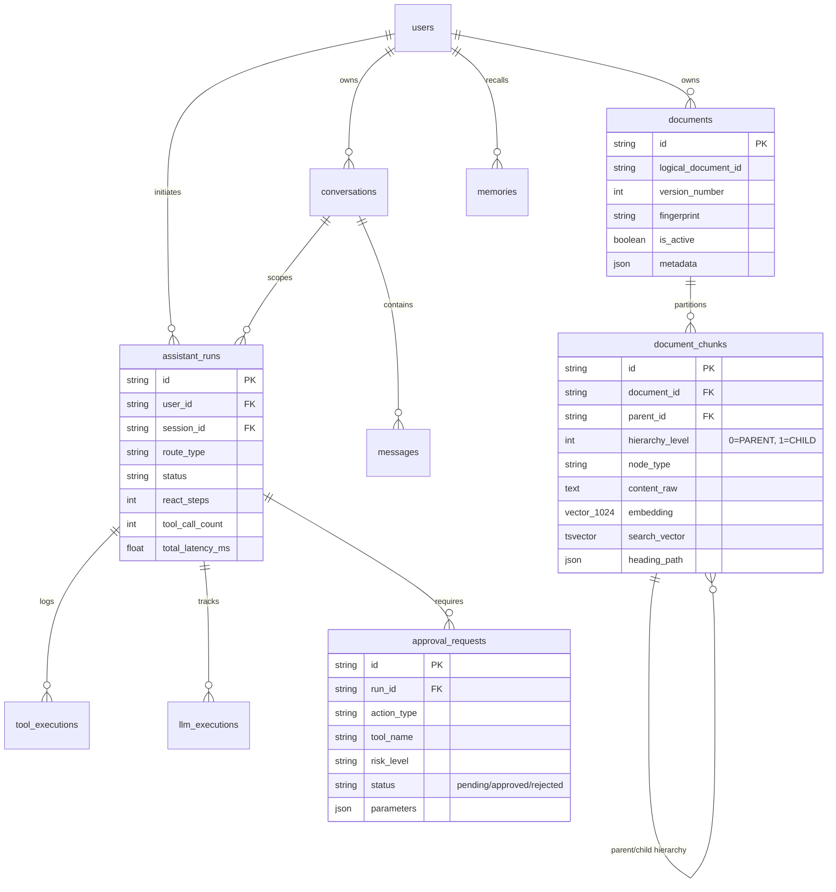

# SYSTEM ARCHITECTURE & RAG PIPELINE TECHNICAL MANUAL (DỰ ÁN PERSONAL AI ASSISTANT)

Bộ tài liệu này tổng hợp toàn bộ kiến trúc hệ thống, 3 tuyến thực thi, các phân vùng bảo mật, vòng lặp Agent ReAct và chi tiết chuyên sâu 2 Pipeline RAG (Document Ingestion & Retrieval Synthesis) dưới dạng **Sách Tham Khảo Kỹ Thuật (Technical Manual - 6 Tập)**.

---

## 📚 DANH MỤC CÁC TẬP TÀI LIỆU KỸ THUẬT CHUYÊN SÂU

| Tập | Tên Tài Liệu | Nội Dung Trọng Tâm |
| :---: | :--- | :--- |
| **Tập 1** | 📗 [`01-system-overview-and-architecture.md`](file:///d:/Code/personal_ai_assistant/docs/architecture/01-system-overview-and-architecture.md) | **Tổng Quan Kiến Trúc 6 Tầng & Hạ Tầng**: Triết lý thiết kế cốt lõi, sơ đồ kiến trúc tổng thể, Gateway/Middleware (`main.py`), MemoryGate (`Redis` + `pgvector`), Correlation Tracing và vòng đời Request. |
| **Tập 2** | 📙 [`02-execution-paths-and-routing.md`](file:///d:/Code/personal_ai_assistant/docs/architecture/02-execution-paths-and-routing.md) | **Chi Tiết 3 Tuyến Thực Thi & Fast Triage Router**: Thuật toán Fast Triage Classifier (`triage.py`), Safety Filters Regex, Path A (Direct Specialist < 2-3s), Path B (Known Workflow LangGraph Parallel), Path C (Supervisor DAG Orchestration & Re-planning). |
| **Tập 3** | 📘 [`03-specialist-agents-and-react-runtime.md`](file:///d:/Code/personal_ai_assistant/docs/architecture/03-specialist-agents-and-react-runtime.md) | **Specialist Agents & Bounded ReAct Runtime**: Ranh giới 4 Agents (Least Privilege), luồng vận hành `SpecialistRunner` (`react.py`), thuật toán `RepeatToolGuard` & Circuit Breaker ngắt lặp tool MD5, quản lý ngân sách execution budget. |
| **Tập 4** | 📕 [`04-security-policy-engine-and-hitl.md`](file:///d:/Code/personal_ai_assistant/docs/architecture/04-security-policy-engine-and-hitl.md) | **Bảo Mật, Policy Engine & Human-in-the-Loop (HITL)**: Phân loại 4 nhóm rủi ro hành động (`READ`, `SAFE_WRITE`, `MUTATION`, `DESTRUCTIVE`), quy trình phê duyệt người dùng, thuật toán sinh `ApprovalToken` mã hóa HMAC-SHA256 đơn sử dụng và CapabilityGate. |
| **Tập 5** | 📓 [`05-document-ingestion-pipeline.md`](file:///d:/Code/personal_ai_assistant/docs/architecture/05-document-ingestion-pipeline.md) | **Pipeline Nạp & Đánh Chỉ Mục Tài Liệu (Ingestion - P09)**: Fingerprinting SHA-256 idempotency, Document Parsing & Gating (`DoclingParser`, `PaddleOCR-VL-1.6 GGUF` sidecar), Hierarchical Parent-Child Chunking (Level 0 Parent 1600t vs Level 1 Child 500t), HNSW Vector & GIN FTS Dual Indexing, Atomic Activation `is_active` zero downtime. |
| **Tập 6** | 📔 [`06-rag-retrieval-and-synthesis-pipeline.md`](file:///d:/Code/personal_ai_assistant/docs/architecture/06-rag-retrieval-and-synthesis-pipeline.md) | **Pipeline Tìm Kiếm & Tổng Hợp Câu Trả Lời (Retrieval Synthesis - P10)**: Security Scope Filtering, Concurrent Hybrid Search (`asyncio.gather` Dense pgvector Cosine `<=>` + Sparse FTS `websearch_to_tsquery`), RRF Fusion ($k=60$), ViRanker Cross-Encoder score $\ge 0.3$, Context Expansion Policies, Greedy Token Packing, Deterministic Sufficiency Check & Bounded Retry, Prompt Injection XML Boundary `<retrieved_document>` & Answer Synthesizer với trích dẫn `[evidence_id]`. |

---

## 🎯 BẢNG TỔNG HỢP HẰNG SỐ & MÔ HÌNH DỮ LIỆU CƠ SỞ (CORE ERD)

### Bảng Thông Số Kỹ Thuật Trọng Yếu

| Hạng mục | Tham số / Model | Giá trị thực tế | Ý nghĩa kiến trúc |
| :--- | :--- | :--- | :--- |
| **Embedding Model** | Kích thước & Tên model | `AITeamVN/Vietnamese_Embedding` (1024 dims) | Chạy local offline, tối ưu riêng cho tiếng Việt, L2-normalized. |
| **Reranker Model** | Tên model & Ngưỡng | `namdp-ptit/ViRanker` (Score $\ge 0.3$) | Cross-Encoder lọc bỏ hiệu quả các candidate kém tương quan. |
| **Chunking Size** | Parent / Child Target | Parent: 1600 tokens · Child: 500 tokens | Bảo toàn ngữ cảnh câu/đoạn, không cắt vỡ bảng biểu. |
| **Hybrid Fusion** | Thuật toán & Hằng số | RRF ($k=60$) | Cân bằng Dense (Ý nghĩa) và Sparse (Từ khóa FTS). |
| **Retry Cap** | Retrieval Retry Limit | Maximum **2** attempts | Ngăn lặp vô tận, Latency p95 $\le 800$ms. |
| **ReAct Loop** | Step Limits | Max 4–6 steps, max 8-10 tool calls | Kiểm soát ngân sách token và ngắt mạch với `RepeatToolGuard`. |

---

### Sơ Đồ Mô Hình Dữ Liệu Cơ Sở (Core 14 Database Tables ERD)

