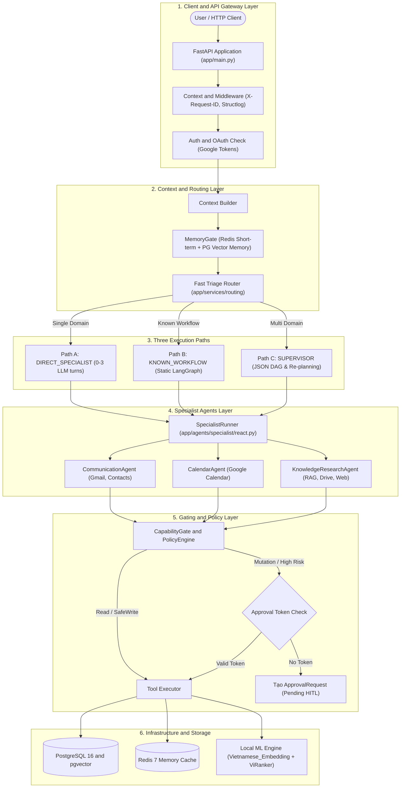
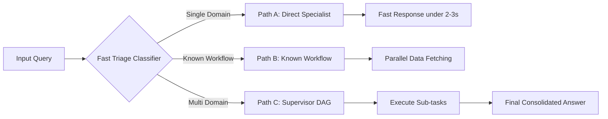
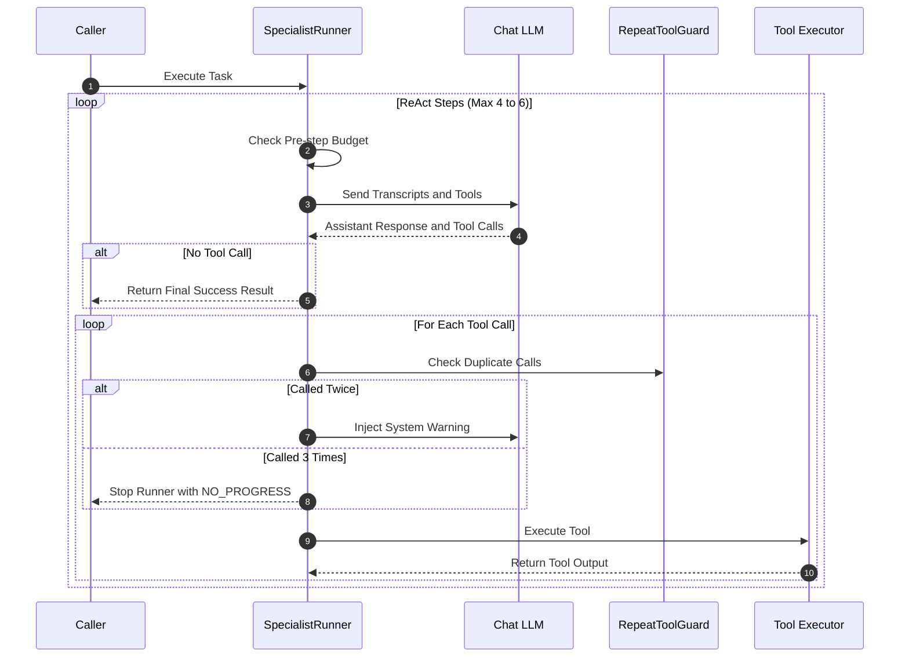
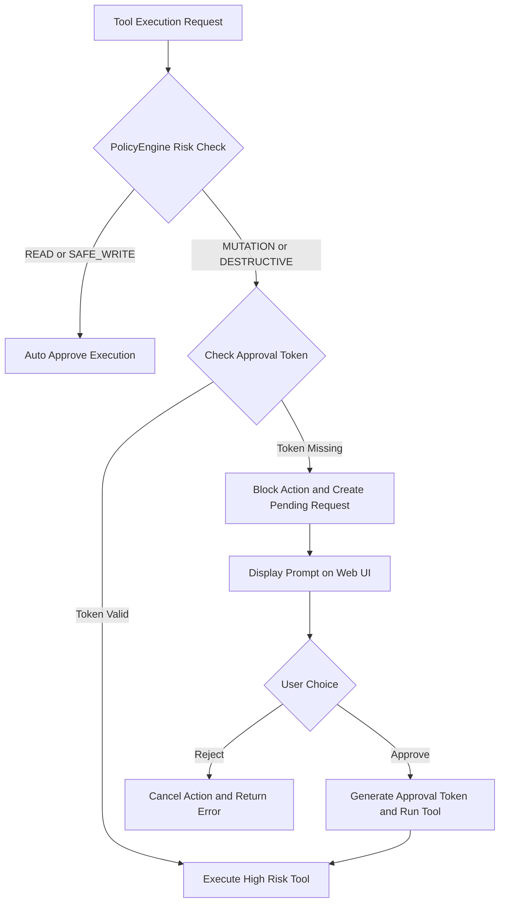
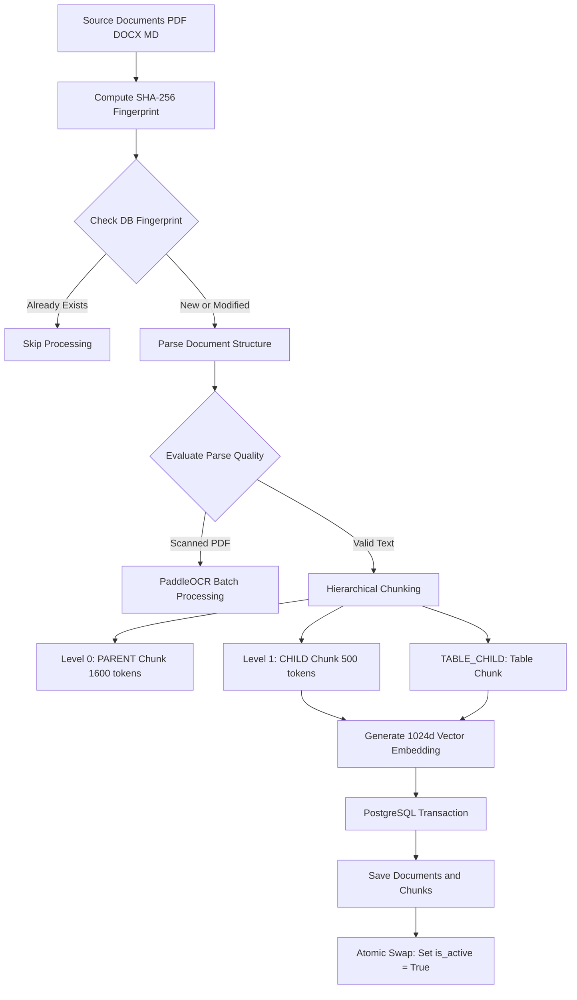
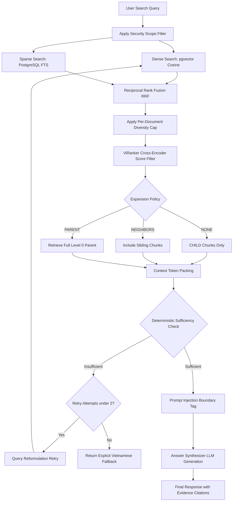
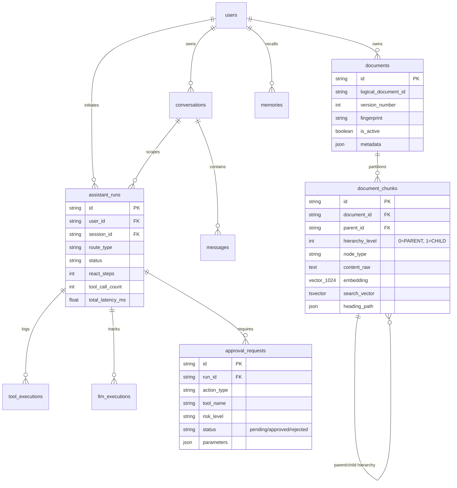

# GIÁO TRÌNH KIẾN TRÚC HỆ THỐNG & PIPELINE RAG CHUYÊN SÂU (PERSONAL AI ASSISTANT MANUAL)

> **Cấp độ tài liệu**: Sách tham khảo kỹ thuật chuyên sâu (Technical Architecture & Engineering Manual).
> **Đối tượng**: Kiến trúc sư hệ thống, Lập trình viên AI/Backend, Đội ngũ kiểm thử & Bảo mật.

---

## CHƯƠNG 1: TỔNG QUAN KIẾN TRÚC HỆ THỐNG (END-TO-END SYSTEM ARCHITECTURE)

### 1.1. Triết Lý Thiết Kế Cốt Lõi (Core Design Philosophy)
Hệ thống Trợ lý AI Cá nhân (Personal AI Assistant) được thiết kế nhằm giải quyết đồng thời 3 thách thức lớn của ứng dụng AI doanh nghiệp: **Bùng nổ Latency/Token Cost**, **Ảo giác tri thức (Hallucination)**, và **Nguy cơ rủi ro an toàn dữ liệu**.

Triết lý xuyên suốt hệ thống là:
> *"Multi-Agent is a capability boundary, not an execution requirement"*
> (Đa tác tử là ranh giới phân định năng lực và bảo mật, không phải là yêu cầu bắt buộc cho mọi luồng thực thi).

### 1.2. Sơ Đồ Kiến Trúc Tổng Thể 6 Tầng



---

### 1.3. Phân Tích Chi Tiết 6 Tầng Xử Lý Kỹ Thuật

#### 🔹 Tầng 1: Gateway & Middleware (`app/main.py`)
* **Chức năng**: Tiếp nhận HTTP Request từ Web UI/Client, thiết lập môi trường theo dõi và xác thực an toàn.
* **Cơ chế vận hành chi tiết**:
  1. **Correlation Tracing**: Middleware tự động tiêm một mã UUID `X-Request-ID` cho mỗi request và bind vào logger `Structlog`. Mọi log nảy ra trong tiến trình xử lý (từ Gateway đến Agent, DB) đều mang `request_id` này để phục vụ Audit & Debugging.
  2. **Auth & OAuth Check**: Kiểm tra Bearer Token hoặc API Key. Với các tác vụ Google Workspace (Gmail, Calendar, Drive), hệ thống tra cứu OAuth Tokens đã mã hóa trong bảng `google_integrations` để sẵn sàng gọi API đại diện cho người dùng.

#### 🔹 Tầng 2: MemoryGate & Fast Triage Router (`app/services/routing/`)
* **Chức năng**: Thu thập ngữ cảnh và phân loại luồng thực thi tối ưu trong thời gian **dưới 10ms**.
* **Cơ chế vận hành chi tiết**:
  1. **MemoryGate**: Truy vấn Redis lấy lịch sử hội thoại ngắn hạn (Short-term buffer) và gọi `pgvector` tìm kiếm ký ức dài hạn (Long-term memories) trong bảng `memories`.
  2. **Fast Triage Router**: Phân tích truy vấn bằng thuật toán RegEx & Pattern Classifier kết hợp để quyết định câu hỏi sẽ đi theo Tuyến Path A, Path B hay Path C.

#### 🔹 Tầng 3: Ba Tuyến Thực Thi (The 3 Execution Paths)
Tầng trung tâm điều phối yêu cầu người dùng theo 3 mức độ phức tạp để tối ưu Latency và chi phí Token (xem chi tiết tại **Chương 2**).

#### 🔹 Tầng 4: Specialist Agents Layer (`app/agents/specialist/`)
Hệ thống gồm 4 Agent độc lập được quản lý tập trung bởi `SpecialistRunner`:
1. `CommunicationAgent`: Chuyên trách Gmail & Contacts.
2. `CalendarAgent`: Chuyên trách Google Calendar & Số học lịch biểu.
3. `KnowledgeResearchAgent`: Chuyên trách RAG tài liệu, Google Drive & Web Search (100% Read-only).
4. `SupervisorAgent`: Chuyên trách lập kế hoạch DAG và điều phối tác vụ đa miền.

#### 🔹 Tầng 5: Gating & Policy Layer (`app/services/approvals/`)
* **CapabilityGate**: Xây dựng danh sách công cụ tối thiểu (Least Privilege) cho từng Agent.
* **PolicyEngine**: Kiểm soát rủi ro thực thi các hành động ghi/xóa dữ liệu (xem chi tiết tại **Chương 4**).

#### 🔹 Tầng 6: Infrastructure & Storage Layer
* **PostgreSQL 16**: Lưu trữ 14 bảng dữ liệu core, hỗ trợ chỉ mục Vector HNSW và chỉ mục Từ khóa Full-Text Search GIN.
* **Redis 7**: Caching ngắn hạn, Session Management và Distributed Locks.
* **Local ML Engine**: Chạy offline mô hình Embedding `AITeamVN/Vietnamese_Embedding` 1024d và Cross-Encoder `namdp-ptit/ViRanker`.

---

## CHƯƠNG 2: CHI TIẾT SÂU VỀ 3 TUYẾN THỰC THI (THE 3 EXECUTION PATHS)



---

### 2.1. Giải Thuật Chi Tiết Của Fast Triage Classifier (`app/services/routing/triage.py`)

Hàm `FastTriage.triage(query: str) -> RouteDecision` thực thi theo thứ tự 6 bước đệm nghiêm ngặt:

1. **Bước 1: Tiền xử lý & Caching Unaccented Text**
   * Chuẩn hóa chuỗi văn bản `query.strip()`.
   * Chạy hàm `unaccent_vietnamese(normalized)` để tạo một bản sao không dấu và lưu cache lại trong phạm vi cuộc gọi (M9 Optimization), loại bỏ chi phí tính toán lại ở các bước sau.

2. **Bước 2: Bộ lọc An toàn Nghiêm ngặt (Strict Safety Filter)**
   * **Prompt Attack / Jailbreak Check**: Kiểm tra chuỗi bằng mẫu regex `PROMPT_ATTACK_PATTERN` (phát hiện các từ khóa tấn công như *"ignore previous instructions"*, *"system prompt"*, *"bỏ qua tất cả chỉ thị"*). Nếu khớp $\rightarrow$ Trả về `RouteDecision(RouteType.REJECT, reason_code="SAFETY_REJECT")` lập tức.
   * **Destructive Command Check**: Kiểm tra câu lệnh phá hoại SQL/OS bằng `DESTRUCTIVE_COMMAND_PATTERN` (vd: `DROP TABLE`, `RM -RF`). Nếu không phải là câu hỏi định nghĩa lý thuyết (`DEFINITIONAL_INQUIRY_PATTERN`) $\rightarrow$ Trả về `REJECT`.

3. **Bước 3: Nhận diện Miền Tác vụ (Domain Predicates Detection)**
   * **Calendar Domain**: Kiểm tra sự xuất hiện của từ khóa lịch (`CALENDAR_CORE`), câu hỏi thời gian (`CALENDAR_INQUIRY`), từ chỉ mốc thời gian tương đối (`CALENDAR_RELATIVE`) hoặc thứ trong tuần (`CALENDAR_WEEKDAY`).
   * **Communication Domain**: Kiểm tra mẫu email/tin nhắn (`COMMUNICATION_PATTERN`), thư mời (`INVITATION_PATTERN`) hoặc nhu cầu phản hồi sau họp (`FOLLOWUP_AFTER_MEETING`).
   * **Knowledge Research Domain**: Kiểm tra sự xuất hiện của từ khóa tài liệu (`RESEARCH_DOC_PATTERN`) kết hợp động từ tra cứu (`RESEARCH_LOOKUP_PATTERN`).

4. **Bước 4: Khớp Kịch Bản Cố Định (Static Workflow Matching)**
   * Kiểm tra xem truy vấn có khớp với các mẫu kích hoạt của `StaticWorkflowRegistry` (như `WF-01`, `WF-02`, `WF-05`). Nếu khớp $\rightarrow$ Chọn **Path B (Known Workflow)** với độ tin cậy $0.95$.

5. **Bước 5: Khớp Kỹ Năng Động (Dynamic Skill Matching)**
   * Duyệt danh sách kỹ năng trong `SkillRegistry`. Nếu kỹ năng yêu cầu năng lực đa miền chéo (ví dụ vừa cần `calendar` vừa cần `gmail`) $\rightarrow$ Chuyển sang **Path C (Supervisor DAG)**.

6. **Bước 6: Quyết định Phân Tuyến Cuối Cùng (Route Resolution)**
   * Nếu chỉ có 1 miền duy nhất (`has_calendar` XÔR `has_comm` XÔR `has_research`) $\rightarrow$ Chọn **Path A (Direct Specialist)**.
   * Nếu có từ 2 miền trở lên hoặc chứa liên từ kết hợp nhiều bước (`_MULTI_STEP_CONJUNCTIONS`: *"rồi"*, *"sau đó"*, *"đồng thời"*) $\rightarrow$ Chọn **Path C (Supervisor DAG)**.

---

### 2.2. Tuyến Path A: Direct Specialist Execution

#### 🔹 Hoạt động bên trong (Internal Execution Flow):
1. **Dispatcher Routing**: `AgentDispatcher` nhận chỉ thị từ Fast Triage, khởi tạo `SpecialistRunner` với đúng Specialist Agent tương ứng (vd: `CalendarAgent`).
2. **Mode Selection (`react.py`)**: `ModeSelector.select()` kiểm tra yêu cầu. Nếu câu hỏi đơn giản (vd: *"Lịch ngày mai của tôi"*), Runner khởi chạy ở chế độ **DIRECT (1-shot completion)**.
3. **1-Shot LLM Turn**:
   * Runner tạo Prompt gồm System Preamble + Goal + Danh sách Tool Schema được cấp.
   * LLM trả về câu trả lời trực tiếp mà không cần vòng lặp ReAct suy luận phức tạp.
4. **Escalation Policy**: Nếu LLM phát hiện cần gọi Tool để lấy dữ liệu thực tế, Runner tự động chuyển nhẹ sang luồng **Bounded ReAct (1-3 turns)** để thực thi Tool rồi tổng hợp kết quả ngay.

#### 🔹 Tại sao chọn Path A? (Architectural Rationale)
* **Tốc độ**: Loại bỏ hoàn toàn lượt gọi LLM phân rã nhiệm vụ của Supervisor, giảm Latency từ 8s xuống **< 2-3s**.
* **Tiết kiệm chi phí**: Tiết kiệm hơn 70% số lượng token LLM cho các câu hỏi tra cứu thông thường.

---

### 2.3. Tuyến Path B: Known Workflow (LangGraph Compiled Graph)

#### 🔹 Hoạt động bên trong (Internal Execution Flow):
1. **Registry Lookup**: Fast Triage khớp từ khóa và kích hoạt quy trình tĩnh đã đăng ký trong `StaticWorkflowRegistry` (như `WF-01: Quick Meeting Follow-up`, `WF-02: Document Search & Briefing`).
2. **LangGraph Graph Execution**:
   * Hệ thống nạp đồ thị tĩnh đã biên dịch sẵn trong `app/harness/workflows/`.
   * Các Node độc lập (vd: `fetch_calendar_events`, `fetch_gmail_threads`, `search_rag_documents`) được khởi chạy **song song (Parallel Execution)** thông qua cơ chế `Send` của LangGraph.
3. **State Merging & Synthesis**: Kết quả từ các luồng song song được gộp vào State chung của LangGraph. Một lượt LLM duy nhất ở Node cuối làm nhiệm vụ tổng hợp văn bản trả về người dùng.

#### 🔹 Tại sao chọn Path B?
* **Tối ưu Latency**: Việc lấy dữ liệu song song từ 3 nguồn (Calendar, Gmail, RAG) giảm hơn **30% Latency** so với việc gọi Agent chạy nối tiếp từng bước.
* **Ổn định tuyệt đối**: Không lo LLM lập kế hoạch sai bước vì cấu trúc đồ thị là cố định và đã được kiểm thử 100%.

---

### 2.4. Tuyến Path C: Supervisor DAG Orchestration

#### 🔹 Hoạt động bên trong (Internal Execution Flow):
1. **DAG Generation**: `SupervisorAgent` tiếp nhận câu hỏi mở đa miền, gọi LLM để phân rã nhiệm vụ thành đồ thị hướng không chu trình (DAG) dưới định dạng JSON Schema:
   ```json
   {
     "subtasks": [
       {"id": "t1", "agent": "KnowledgeResearchAgent", "goal": "Tìm hợp đồng trên Drive"},
       {"id": "t2", "agent": "CommunicationAgent", "goal": "Đọc email mới nhất từ đối tác", "dependencies": []},
       {"id": "t3", "agent": "CalendarAgent", "goal": "Xếp lịch họp xử lý khác biệt", "dependencies": ["t1", "t2"]}
     ]
   }
   ```
2. **Topological Subtask Execution**: Supervisor điều phối các Specialist Agent thực thi từng sub-task theo đúng thứ tự phụ thuộc. Kết quả của `t1` và `t2` được gom lại làm dữ liệu đầu vào cho `t3`.
3. **Re-planning Loop**: Nếu một sub-task gặp lỗi hoặc thiếu dữ liệu, `SupervisorAgent` sẽ đánh giá lại và tiến hành **Lập lại kế hoạch (Re-planning tối đa 2 lần)** để tìm chiến thuật thay thế.

---

## CHƯƠNG 3: SPECIALIST AGENT REACT RUNTIME & Anti-Loop CIRCUIT BREAKER



---

### 3.1. Cấu Trúc Vận Hành `SpecialistRunner` (`react.py`)

Mọi Specialist Agent đều chạy trong khung kiểm soát của `SpecialistRunner`:
* **Ngân sách thực thi (Budget Limits)**:
  * `max_steps`: Giới hạn tối đa 4–6 bước suy luận.
  * `max_tool_calls`: Giới hạn tối đa 8–10 lượt gọi công cụ.
  * `timeout`: Giới hạn thời gian chạy tối đa 30 giây.

### 3.2. Thuật Toán `RepeatToolGuard` & Circuit Breaker

Để giải quyết triệt để sự cố LLM bị kẹt trong vòng lặp gọi lại cùng một tool với tham số giống nhau:
1. Mỗi lần LLM yêu cầu gọi Tool, `RepeatToolGuard` tính toán chuỗi băm:
   $$\text{Hash} = \text{MD5}(\text{tool\_name} + \text{sorted\_json\_args})$$
2. **Nếu trùng lần 2**: Runner tự động chèn thêm một System Reminder vào lượt thoại tiếp theo: *"Cảnh báo: Bạn đã gọi công cụ {tool_name} với cùng tham số 2 lần nhưng không thu được kết quả mới. Hãy thử thay đổi tham số hoặc đổi công cụ khác."*
3. **Nếu trùng lần 3**: Kích hoạt **Circuit Breaker** lập tức ngắt ReAct Loop và kết thúc với lý do `NO_PROGRESS`, bảo vệ hệ thống khỏi việc đốt token vô ích.

---

## CHƯƠNG 4: POLICY ENGINE & HUMAN-IN-THE-LOOP (HITL) APPROVAL FLOW



---

### 4.1. Phân Loại 4 Nhóm Rủi Ro Tool Action
1. `READ`: Các tác vụ đọc dữ liệu (vd: `gmail.search_messages`, `calendar.list_events`) $\rightarrow$ **Auto Approve**.
2. `SAFE_WRITE`: Các tác vụ tạo bản nháp không gây ảnh hưởng ra bên ngoài (vd: `gmail.create_draft`) $\rightarrow$ **Auto Approve**.
3. `MUTATION`: Các tác vụ gửi/sửa dữ liệu thật (vd: `gmail.send_draft`, `calendar.update_event`) $\rightarrow$ **Bắt buộc có Approval Token**.
4. `DESTRUCTIVE`: Các tác vụ xóa dữ liệu không thể khôi phục (vd: `drive.delete_file`, `gmail.trash`) $\rightarrow$ **Bắt buộc có Approval Token**.

### 4.2. Quy Trình Phê Duyệt An Toàn (HITL Workflow)
1. Khi Agent gọi tool `MUTATION` mà thiếu `approval_token`, Tool Executor sẽ chặn thực thi và ném ngoại lệ `PermissionDeniedError`.
2. Hệ thống tạo một bản ghi `ApprovalRequest` trong cơ sở dữ liệu với trạng thái `pending` và gửi thông tin chi tiết hành động lên Web UI.
3. Người dùng xem xét chi tiết (tên tool, tham số gửi đi) và bấm **Approve**.
4. Server sinh ra một `ApprovalToken` mã hóa HMAC-SHA256 đơn sử dụng. Agent dùng Token này để thực thi tool thành công.

---

## CHƯƠNG 5: CHI TIẾT PIPELINE RAG 1 - DOCUMENT INGESTION (P09)

Pipeline Ingestion chuyển đổi tập tin thô (PDF, DOCX, MD) thành chỉ mục tri thức cấu trúc trong PostgreSQL.



---

### 5.1. Các Bước Xử Lý Kỹ Thuật Chi Tiết:

#### 1. Fingerprinting & Deduplication (`fingerprint.py`)
Tính toán mã vân tay SHA-256 nguyên tử:
$$\text{Fingerprint} = \text{SHA256}(\text{source\_id} + \text{content\_hash} + \text{parser\_ver} + \text{chunker\_ver} + \text{model\_ver})$$
Nếu mã fingerprint đã tồn tại trong bảng `documents` $\rightarrow$ Trả về `IngestionStatus.SKIPPED`, tiết kiệm 100% chi phí CPU/GPU nhúng vector.

#### 2. Parsing & Parse Quality Gating (`parsing/`)
* Chạy `MarkdownDocumentParser` cho file `.md` và `DoclingParser` cho PDF/DOCX để dựng cây tài liệu `NormalizedDocumentTree`.
* Hàm `evaluate_parse_quality()` kiểm tra mật độ text. Nếu file PDF là ảnh scan $\rightarrow$ Gán trạng thái `NEEDS_OCR` đẩy vào hàng đợi offline batch `scripts/ocr_batch.py` chạy mô hình **PaddleOCR-VL-1.6 GGUF** để tạo file sidecar `*.ocr.json`.

#### 3. Structure-aware Hierarchical Chunking (`chunking/`)
* **Level 0 (PARENT Chunk - `parents.py`)**: Target **1600 tokens**, Hard Max **2400 tokens**. Lưu trọn vẹn chương/mục lớn. **Chỉ chứa text thô, không nhúng vector**.
* **Level 1 (CHILD Chunk - `children.py`)**: Target **500 tokens**, Hard Max **800 tokens**. Cắt mịn theo từng câu. **Có nhúng Vector 1024d & FTS**.
* **TABLE_CHILD**: Bảo toàn trọn vẹn cấu trúc bảng biểu, Header và các nhóm hàng.

#### 4. Local Embedding & Atomic Persistence (`persistence.py`)
* Mô hình local `AITeamVN/Vietnamese_Embedding` tạo vector 1024 chiều L2-normalized.
* Mở SQL Transaction ghi bản ghi `documents` (candidate $N+1$) và `document_chunks`.
* Cột `embedding` được đánh chỉ mục **HNSW** (`vector_cosine_ops`), cột `search_vector` được đánh chỉ mục từ khóa **GIN** (`vietnamese_simple`).
* Hàm `activate_candidate()` thực hiện tráo đổi trạng thái `is_active = True` cho $N+1$ và `is_active = False` cho bản ghi cũ trong 1ms (Zero downtime).

---

## CHƯƠNG 6: CHI TIẾT PIPELINE RAG 2 - RETRIEVAL & ANSWER SYNTHESIS (P10)

Pipeline Retrieval thực thi tra cứu tri thức qua 6 bước khép kín:



---

### 6.1. Chi Tiết Thực Thi Kỹ Thuật 6 Bước Retrieval:

#### Bước 1: Security Scope Filtering (`provider.py`)
Áp đặt điều kiện SQL phân quyền truy vấn:
```sql
WHERE d.is_active = TRUE AND (d.user_id = :requester_id OR d.user_id IS NULL)
```

#### Bước 2: Concurrent Hybrid Search (`hybrid.py`)
Thực thi song song qua `asyncio.gather`:
* **Dense Leg (`dense.py`)**: Vector 1024d $\rightarrow$ SQL query Cosine Distance:
  ```sql
  SELECT c.id AS chunk_id, c.parent_id, c.document_id, c.content_raw,
         (c.embedding <=> ':vector'::vector) AS score
  FROM document_chunks c JOIN documents d ON c.document_id = d.id
  WHERE c.hierarchy_level = 1 AND d.is_active = TRUE AND ...
  ORDER BY c.embedding <=> ':vector'::vector ASC LIMIT :top_k_dense;
  ```
* **Sparse Leg (`sparse.py`)**: SQL query Full-Text Search dùng `websearch_to_tsquery`:
  ```sql
  SELECT c.id AS chunk_id, c.parent_id, c.document_id, c.content_raw,
         ts_rank_cd(c.search_vector, websearch_to_tsquery('public.vietnamese_simple', :query)) AS score
  FROM document_chunks c JOIN documents d ON c.document_id = d.id
  WHERE c.hierarchy_level = 1 AND c.search_vector @@ websearch_to_tsquery('public.vietnamese_simple', :query)
  ORDER BY score DESC LIMIT :top_k_sparse;
  ```

#### Bước 3: RRF Fusion, Diversity Cap & ViRanker Reranking
* **RRF Fusion**: Tổng hợp điểm thứ hạng kết hợp ($k=60$):
  $$\text{fusion\_score}(c) = \sum_{s \in \{\text{dense}, \text{sparse}\}} \frac{1}{60 + \text{rank}_s(c)}$$
* **Diversity Cap (`diversity.py`)**: Giới hạn tối đa `per_document_cap` chunk cho mỗi file.
* **ViRanker Cross-Encoder (`rerank.py`)**: Mô hình local `namdp-ptit/ViRanker` đánh giá tương quan trực tiếp, **lọc bỏ các candidate có score < 0.3**.

#### Bước 4: Context Expansion & Token Packing
* **Expansion Policy (`expansion.py`)**: `NONE` (CHILD), `NEIGHBORS` (sibling chunks), hoặc `PARENT` (truy vấn kéo trọn văn bản thô Level 0 PARENT 1600 tokens).
* **Token Packing (`packing.py`)**: Greedy fill các item vào `EvidenceBundle` theo `token_budget` mà không làm ngắt vỡ câu.

#### Bước 5: Deterministic Sufficiency Check & Bounded Retry (`sufficiency.py`, `retry.py`)
* Đánh giá độ đủ dữ liệu qua quy tắc deterministic **(0% tốn LLM judge)**.
* Nếu `INSUFFICIENT` hoặc `PARTIAL` $\rightarrow$ Thực hiện Query Reformulation (tăng K, nới filter) và retry **tối đa 2 lần**.
* Sau 2 lượt vẫn thiếu dữ liệu $\rightarrow$ Trả về câu từ chối chuẩn tiếng Việt: *"Tôi không tìm thấy đủ tài liệu nội bộ để trả lời câu hỏi này."* (Triệt tiêu Ảo giác).

#### Bước 6: Prompt Injection Defense & Answer Synthesis (`synthesis.py`)
* **Injection Boundary (`injection_boundary.py`)**: Bọc nội dung trích xuất trong thẻ XML `<retrieved_document>` để cách ly dữ liệu không tin cậy.
* **Synthesis**: LLM tổng hợp câu trả lời tiếng Việt và đính kèm mã trích dẫn `[evidence_id]` ứng với tiêu đề file và số trang cụ thể.

---

## CHƯƠNG 7: BẢNG TỔNG HỢP HẰNG SỐ & MÔ HÌNH DỮ LIỆU CƠ SỞ (CORE DB ERD)

### 7.1. Bảng Thông Số Kỹ Thuật Trọng Yếu

| Hạng mục | Tham số / Model | Giá trị thực tế trong mã nguồn | Ý nghĩa kiến trúc |
| :--- | :--- | :--- | :--- |
| **Embedding Model** | Kích thước & Tên model | `AITeamVN/Vietnamese_Embedding` (1024 dims) | Tối ưu riêng cho văn bản tiếng Việt; L2-normalized. |
| **Reranker Model** | Tên model & Ngưỡng | `namdp-ptit/ViRanker` (Score $\ge 0.3$) | Cross-Encoder lọc bỏ hiệu quả các chunk kém tương quan. |
| **Chunking Size** | Parent / Child Target | Parent: 1600 tokens · Child: 500 tokens | Bảo toàn ngữ cảnh câu/đoạn, không cắt vỡ bảng. |
| **Hybrid Fusion** | Thuật toán & Hằng số | RRF ($k=60$) | Cân bằng hoàn hảo giữa Dense (Ý nghĩa) và Sparse (Từ khóa). |
| **Retry Cap** | Retrieval Retry Limit | Maximum **2** attempts | Ngăn lặp vô tận, đảm bảo Latency p95 $\le 800$ms. |
| **ReAct Loop** | Limits | Max 4–6 steps, max 8-10 tool calls | Bảo vệ ngắt mạch (Circuit Breaker) nếu Agent kẹt lặp tool call. |

---

### 7.2. Sơ Đồ Mô Hình Dữ Liệu Cơ Sở (Core 14 Database Tables ERD)


