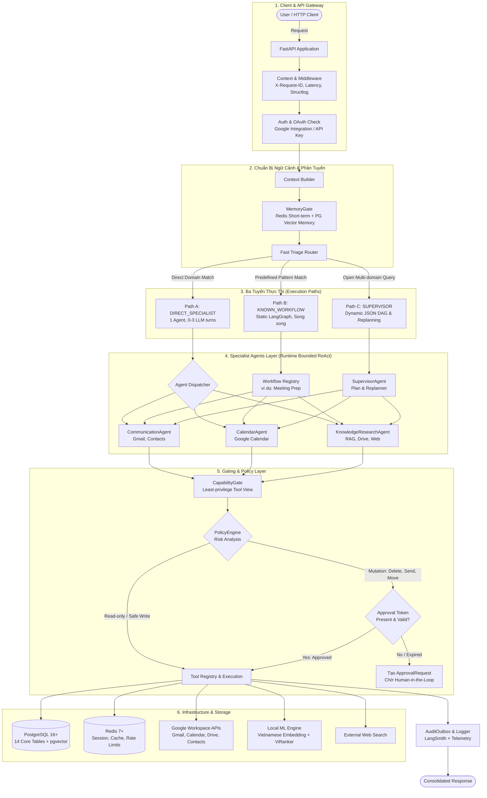
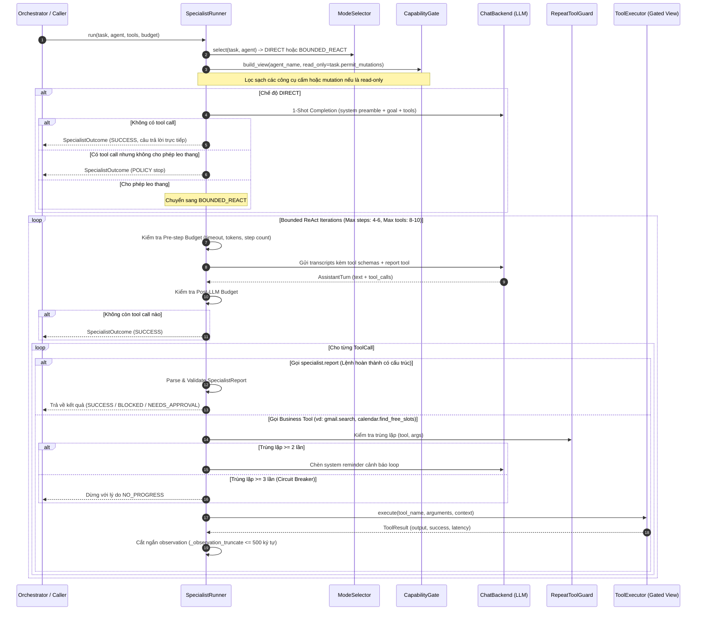
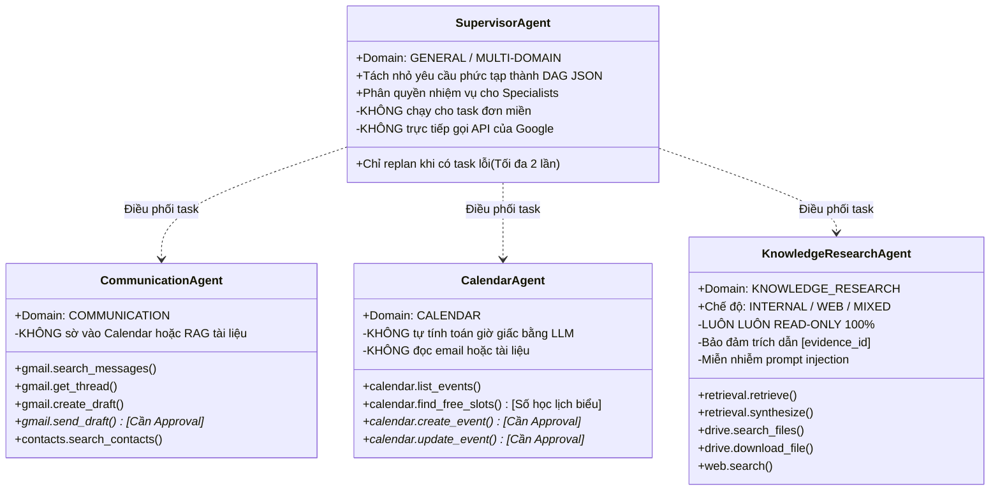
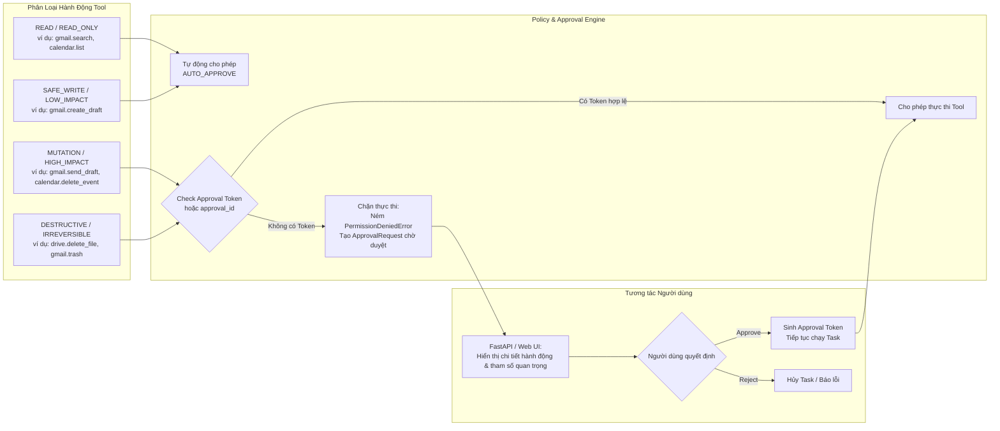
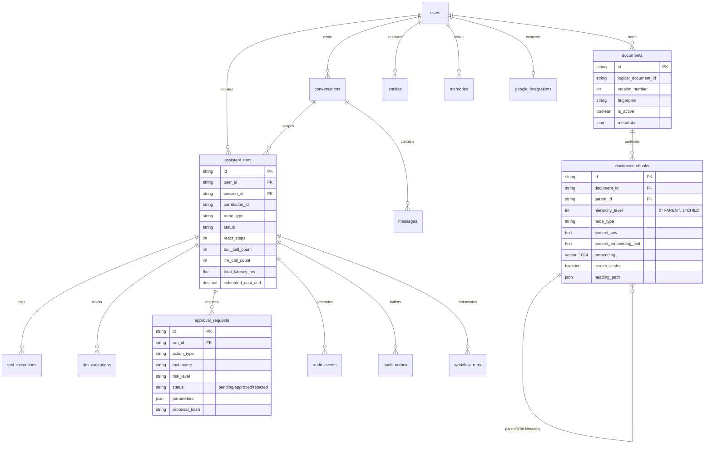

# Toàn Cảnh Kiến Trúc Hệ Thống & Các Pipeline Chi Tiết (Personal AI Assistant)

> **Trạng thái hệ thống**: P0–P12 đã nghiệm thu & đóng (`CLOSED`), Phase 13 (`KnowledgeResearchAgent`) đang thực hiện (`IN PROGRESS`).
> **Triết lý thiết kế cốt lõi**: *"Multi-agent is a capability boundary, not an execution requirement"* (Đa tác tử là ranh giới năng lực, không phải là yêu cầu bắt buộc cho mọi luồng thực thi).

---

## 1. Sơ Đồ Kiến Trúc Tổng Thể Toàn Hệ Thống (End-to-End System Architecture)

Hệ thống xử lý mọi yêu cầu người dùng qua 3 tầng: **Triage & Phân luồng**, **Thực thi (3 Paths)**, và **Hạ tầng kiểm soát an toàn (Policy & Gating)**.



---

## 2. Chi Tiết 3 Tuyến Thực Thi (The 3 Execution Paths)

| Tuyến | Điều Kiện Kích Hoạt | Cơ Chế Điều Phối | Budget Dự Kiến |
| :--- | :--- | :--- | :--- |
| **Path A: Direct Specialist** | Yêu cầu thuộc 1 domain duy nhất (ví dụ: "Lịch ngày mai của tôi", "Tìm email từ Nam") | Fast Triage chuyển thẳng tới Specialist tương ứng. Specialist chạy ở chế độ **Direct** (1-shot tool call) hoặc **Bounded ReAct** (vòng lặp tìm kiếm giới hạn) | 0–1 LLM call (Direct), 1–3 LLM calls (ReAct). Latency: < 2-3s (Direct), 2-6s (ReAct). |
| **Path B: Known Workflow** | Khớp với quy trình chuẩn đã đăng ký trong `WorkflowRegistry` (ví dụ: `WF-05: MeetingPrepGraph`, `DailyBriefing`) | Sử dụng LangGraph tĩnh đã biên dịch trước. Các node fetch dữ liệu (Calendar, Gmail, RAG) chạy **song song (parallel)** không cần Supervisor phân tích | 1–2 LLM synthesis calls, không tốn token lập kế hoạch. Latency giảm > 30%. |
| **Path C: Supervisor DAG** | Nhiệm vụ đa miền, mở, có quan hệ phụ thuộc phức tạp (ví dụ: "So sánh hợp đồng trên Drive với email mới nhất của đối tác và xếp lịch họp xử lý sự khác biệt") | `SupervisorAgent` phân rã câu hỏi thành đồ thị có hướng không chu trình (DAG JSON), điều phối các Specialist thực thi, tái lập kế hoạch (replanning tối đa 2 lần) | 3–5 LLM calls (Plan + Subtasks + Replanning + Final Synthesis). |

---

## 3. Pipeline Xử Lý & Nạp Tài Liệu Nội Bộ (Document Ingestion Pipeline - P09)

Pipeline áp dụng kiến trúc **Structure-aware Hierarchical Parent–Child Chunking**, lưu trữ văn bản song song với vector 1024 chiều và chỉ mục Full-Text Search tiếng Việt.

```mermaid
flowchart TD
    subgraph InputStage["1. Discovery & Fingerprinting"]
        In[Tài liệu nguồn: PDF, DOCX, MD] --> FP[Tính Fingerprint SHA-256\nsource_id + content_hash + chunker_ver + model_ver]
        FP --> DupCheck{Check DB: LogicalDocID\n& Fingerprint}
        DupCheck -->|Trùng khớp| Skip[Bỏ qua - SKIPPED\nKhông re-index lại]
        DupCheck -->|Mới hoặc Sửa đổi| TD[Type Detection\nMIME, Magic Bytes, Extension]
    end

    subgraph ParsingStage["2. Parsing & Parse-Quality Gating"]
        TD --> ParserSelector{Chọn Parser}
        ParserSelector -->|Markdown| MDParser[MarkdownDocumentParser]
        ParserSelector -->|PDF / DOCX| DoclingParser[DoclingParser\ndo_ocr=False]
        MDParser & DoclingParser --> NormTree[Normalized Document Tree\nHeading, Paragraph, Table, Picture]
        NormTree --> QualityCheck{evaluate_parse_quality\nKiểm tra tỷ lệ rác & độ dài text}
        QualityCheck -->|Scan không có text| NeedsOCR[Gán trạng thái: NEEDS_OCR\nĐưa vào hàng đợi Batch]
        QualityCheck -->|Hỏng / Không hợp lệ| Corrupt[Gán trạng thái: CORRUPT / FAILED]
        QualityCheck -->|Đạt chuẩn| TreeReady[Cây tài liệu chuẩn hóa sẵn sàng]
    end

    subgraph OfflineOCR["Đường dẫn Offline OCR (P9E Sidecar)"]
        NeedsOCR -.-> OCRBatch[scripts/ocr_batch.py\nPaddleOCR-VL-1.6 GGUF]
        OCRBatch -.-> SidecarJSON[*.ocr.json Sidecar]
        SidecarJSON -.-> NormTree
    end

    subgraph ChunkingStage["3. Hierarchical Chunking (P09C)"]
        TreeReady --> ParentChunker[SectionParentChunker\nTarget: 1600 tokens\nHard Max: 2400 tokens\nLevel = 0]
        TreeReady --> TableChunker[Table Group Chunker\nBảo toàn Header & Row-groups\nTABLE_CHILD]
        ParentChunker --> ChildChunker[SentenceChildChunker\nTarget: 500 tokens\nHard Max: 800 tokens\nLevel = 1]
    end

    subgraph EmbeddingPersistence["4. Embedding & Atomic Activation (P09D)"]
        ChildChunker & TableChunker --> EmbedSvc[LocalEmbeddingService\nAITeamVN/Vietnamese_Embedding\n1024 dimensions, L2-normalized]
        EmbedSvc --> TxPersist[PostgreSQL Transaction\nwith_for_update row lock]
        TxPersist --> InsDoc[documents: Candidate Version N+1]
        TxPersist --> InsChunks[document_chunks:\nPARENT (level 0, không vector)\nCHILD (level 1, có vector & search_vector)]
        TxPersist --> Activate[activate_candidate:\nis_active = True cho bản N+1\nis_active = False cho bản cũ]
    end
```

### Các đặc tính kỹ thuật quan trọng của Ingestion Pipeline:
1. **Parent-Child Relationship**:
   - **Level 0 (PARENT)**: Lưu trọn vẹn ngữ cảnh đoạn văn lớn (1600-2400 tokens). Không nhúng vector, dùng làm payload giải nén ngữ cảnh khi tạo câu trả lời.
   - **Level 1 (CHILD)**: Được cắt mịn theo câu (350-800 tokens). Nhúng vector 1024 chiều, đóng vai trò đơn vị tìm kiếm cơ sở.
2. **PostgreSQL Dual Indexing**:
   - Chỉ mục Vector: **HNSW** (`vector_cosine_ops`) trên cột `embedding`.
   - Chỉ mục Từ khóa: **GIN** trên cột tính toán `search_vector` sử dụng từ điển `vietnamese_simple` và unaccent mapping.
3. **Idempotency & Zero Downtime**:
   - Bản ghi cũ vẫn `is_active = True` và phục vụ tìm kiếm bình thường trong khi bản ghi mới đang được parse và sinh embedding. Chỉ tráo đổi `is_active` nguyên tử khi toàn bộ transaction commit thành công.

---

## 4. Pipeline Tìm Kiếm & Tổng Hợp Câu Hỏi (RAG Retrieval Pipeline - P10)

Pipeline kết hợp **Hybrid Search (Dense + Sparse)**, **Reciprocal Rank Fusion (RRF)**, **Cross-Encoder Reranking**, và **Bảo vệ chống Prompt Injection**.

```mermaid
flowchart TD
    subgraph QueryIn["1. Tiếp Nhận Truy Vấn"]
        Q[User Query] --> Validate[Xác thực & Trích xuất Filter\nOwner: requester_id OR NULL]
    end

    subgraph HybridSearch["2. Hybrid Search Đồng Thời (asyncio.gather)"]
        Validate --> Dense[Dense Leg\nLocal Embedding 1024d\npgvector Cosine Distance <=>\ntop_k: 20-40]
        Validate --> Sparse[Sparse Leg\nwebsearch_to_tsquery\nPostgreSQL FTS vietnamese_simple\ntop_k: 20-40]
    end

    subgraph FusionRerank["3. Fusion & Reranking"]
        Dense & Sparse --> RRF[Reciprocal Rank Fusion\nScore = Σ 1 / k + rank_source\nk = 60]
        RRF --> Diversity[Apply Diversity\nGiới hạn per_document_cap\nĐảm bảo cân bằng đa tài liệu]
        Diversity --> ViRanker[ViRanker Cross-Encoder\nnamdp-ptit/ViRanker\nLọc ngưỡng threshold >= 0.3]
    end

    subgraph ExpansionPacking["4. Ngữ Cảnh Hóa & Đóng Gói"]
        ViRanker --> ExpResolver{Expansion Policy\nExplicit / Query Hint}
        ExpResolver -->|NONE| FusedOnly[Chỉ dùng CHILD chunks]
        ExpResolver -->|NEIGHBORS| SiblingNodes[Lấy thêm anh em cùng parent]
        ExpResolver -->|PARENT| ParentNodes[Truy vấn lấy PARENT thô (level 0)]
        FusedOnly & SiblingNodes & ParentNodes --> Packing[Context Packing\nKiểm soát chặt budget token\nĐóng gói EvidenceBundle]
    end

    subgraph SufficiencyRetry["5. Sufficiency Check & Bounded Retry (P10C)"]
        Packing --> SuffChecker{SufficiencyChecker\nDeterministic Rules}
        SuffChecker -->|INSUFFICIENT / PARTIAL| RetryPolicy{Số lần thử < 2?}
        RetryPolicy -->|Còn lượt retry| QueryReform[Điều chỉnh Query: Tăng K,\nNới filter, Đổi expansion]
        QueryReform --> Dense
        RetryPolicy -->|Hết lượt retry & internal_only| NoAnswer["Tôi không tìm thấy đủ tài liệu nội bộ\nđể trả lời câu hỏi này."]
        SuffChecker -->|SUFFICIENT| InjectionBoundary[6. Injection Boundary]
    end

    subgraph SynthesisStage["6. Đóng Gói An Toàn & Tổng Hợp"]
        InjectionBoundary --> Sanitize[Bọc nội dung trong thẻ XML:\nretrieved_document\nCấm ghi đè System Prompt]
        Sanitize --> PromptSynth[PromptAnswerSynthesizer\nLLM Generation Callback]
        PromptSynth --> Result[SynthesisResult:\n- Câu trả lời tiếng Việt\n- Trích dẫn chính xác [evidence_id]]
    end
```

---

## 5. Pipeline Vòng Lặp Thực Thi Của Specialist Agent (Bounded ReAct Runtime - P11)

Mọi Specialist Agent (`CommunicationAgent`, `CalendarAgent`, `KnowledgeResearchAgent`) đều được quản lý tập trung bởi `SpecialistRunner` với các cơ chế kiểm soát ngân sách và chống kẹt vòng lặp.



---

## 6. Ranh Giới Trách Nhiệm Của 4 Agent (Agent Boundaries)



---

## 7. Cơ Chế Bảo Mật, Policy Engine & Human-in-the-Loop (HITL)

Để ngăn chặn các hành động phá hoại dữ liệu (xóa file, gửi email ngoài ý muốn, sửa lịch), hệ thống phân loại công cụ thành các nhóm rủi ro:



---

## 8. Sơ Đồ Thực Thể Cơ Sở Dữ Liệu (Core 14 Database Tables)

Cơ sở dữ liệu PostgreSQL lưu trữ trạng thái chạy, nhật ký kiểm toán, dữ liệu RAG, và ngữ cảnh người dùng:



---

## 9. Tổng Hợp Các Hằng Số & Ngưỡng Kỹ Thuật Trọng Yếu (System Thresholds & Constants)

| Hạng mục | Tham số / Hằng số | Giá trị chuẩn trong mã nguồn | Giải thích kiến trúc |
| :--- | :--- | :--- | :--- |
| **Embedding** | Model & Kích thước | `AITeamVN/Vietnamese_Embedding` · 1024 dims | Chạy snapshot local offline; vector L2-normalized. |
| **Reranker** | Model & Ngưỡng | `namdp-ptit/ViRanker` · Ngưỡng `threshold >= 0.3` | Cross-encoder lọc bỏ các chunk kém tương quan trước khi pack token. |
| **Chunking** | Target PARENT / Target CHILD | 1600 tokens (max 2400) / 500 tokens (max 800) | Bảo toàn cấu trúc câu và đoạn; không bao giờ ngắt vụn giữa bảng. |
| **Hybrid Search** | Fusion Top-K & Thuật toán | Dense 20-40, Sparse 20-40 · Reciprocal Rank Fusion (k=60) | Chạy song song không phụ thuộc; FTS dùng từ điển `vietnamese_simple`. |
| **Sufficiency** | Retry Limit | Tối đa 2 vòng truy vấn | Ngăn vòng lặp vô hạn; thất bại sẽ trả về thông báo rõ ràng bằng tiếng Việt. |
| **Specialist ReAct**| Giới hạn bước | `max_steps=4-6`, `max_tool_calls=8-10`, `timeout=30s` | Ngăn agent lặp vô tận khi gọi tool hoặc kẹt lỗi mạng. |
| **Anti-Loop** | Repeat Guard Limits | Nhắc nhở sau 2 lần trùng lặp; Ngắt (circuit break) sau 3 lần | Chống agent gọi lặp đi lặp lại cùng một công cụ với cùng một tham số. |
| **Bảo mật** | Prompt Injection Marker | `<retrieved_document>` | Phân tách ranh giới rõ ràng giữa dữ liệu ngoài và chỉ dẫn hệ thống. |
| **An toàn ghi** | Gating đột biến dữ liệu | `approval_token` bắt buộc cho mọi mutation | Không bao giờ thực thi xóa/gửi dữ liệu mà không có chữ ký duyệt của người dùng. |
